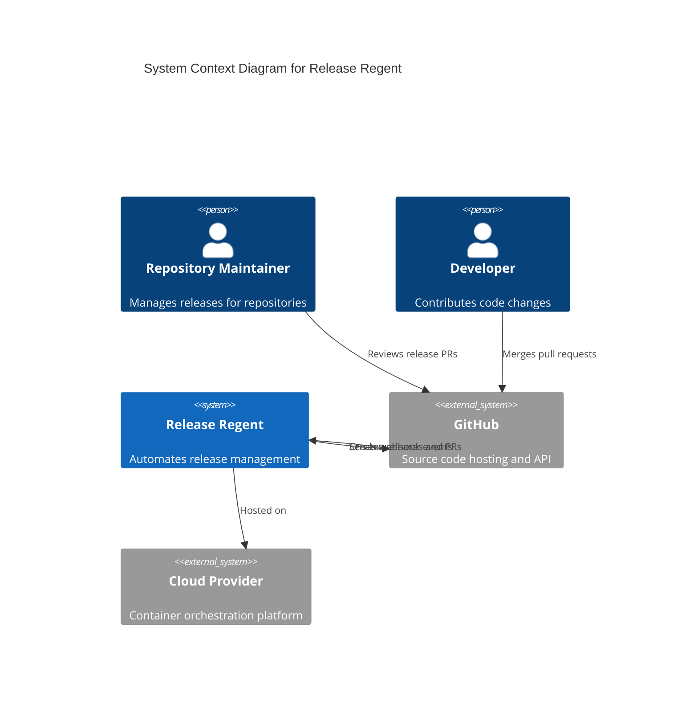
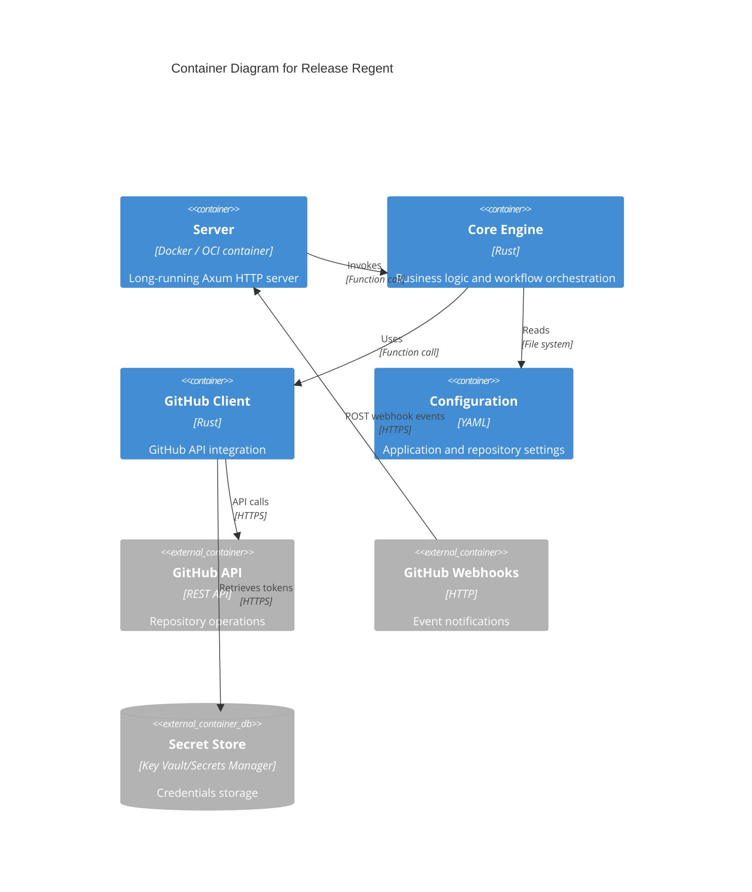
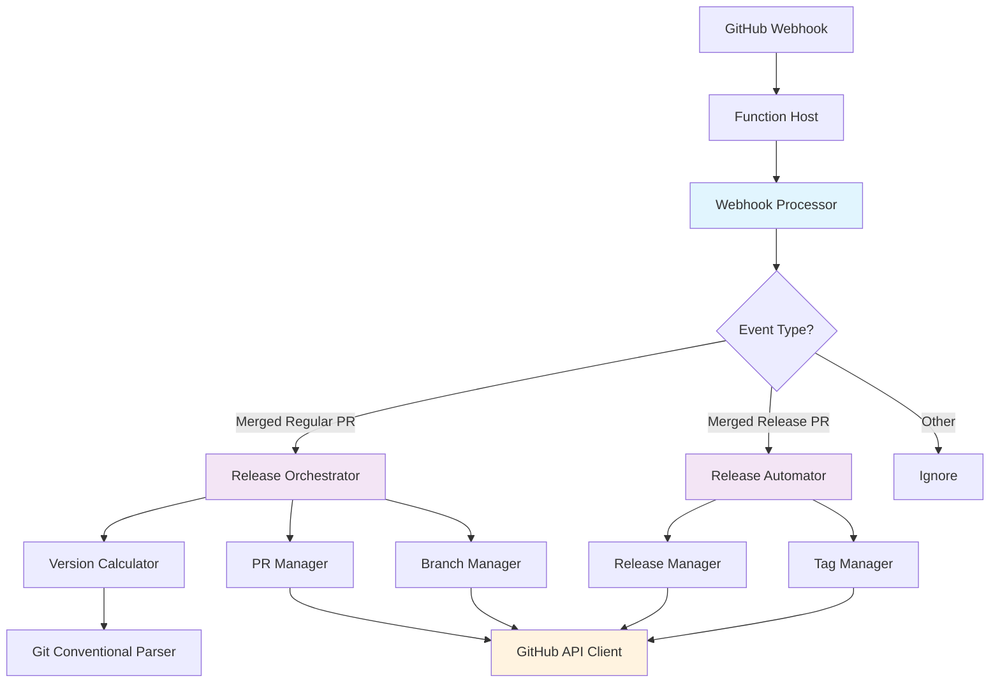
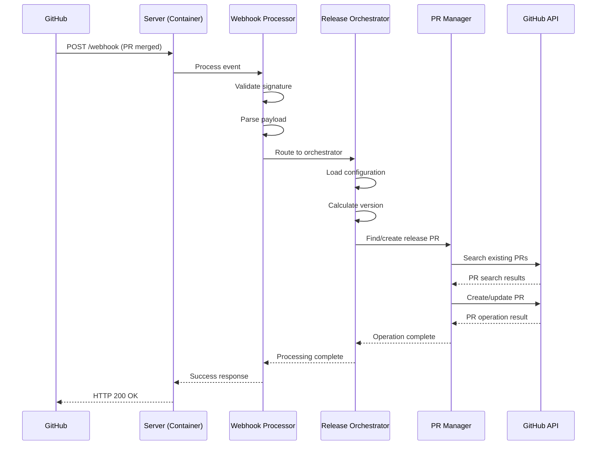
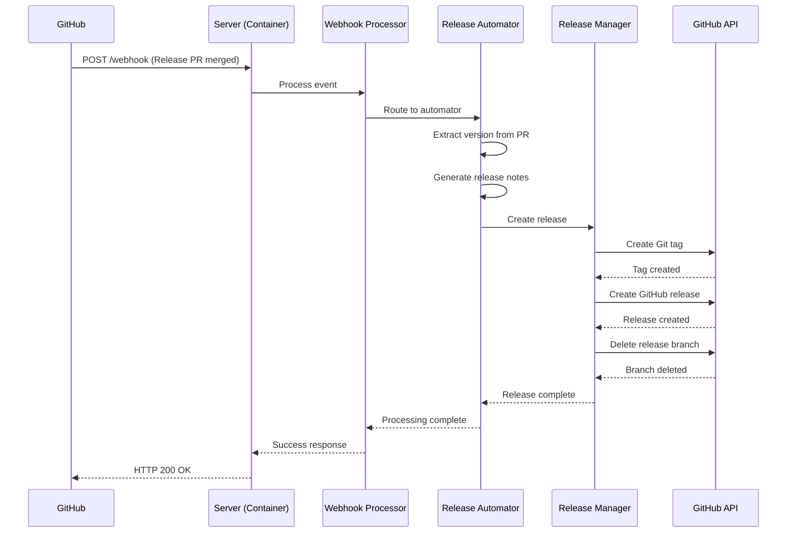
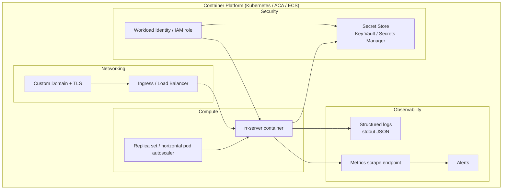
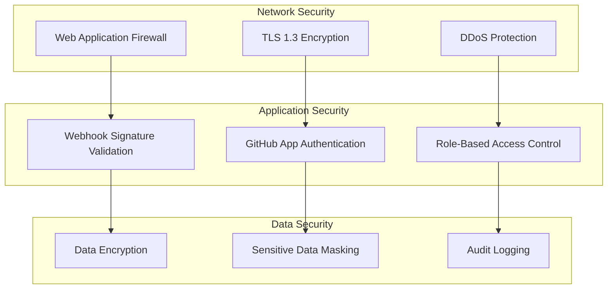
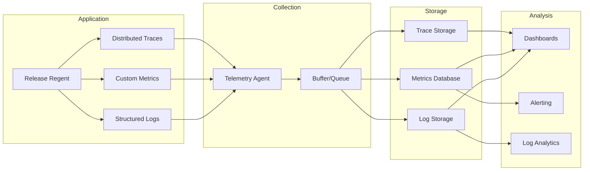
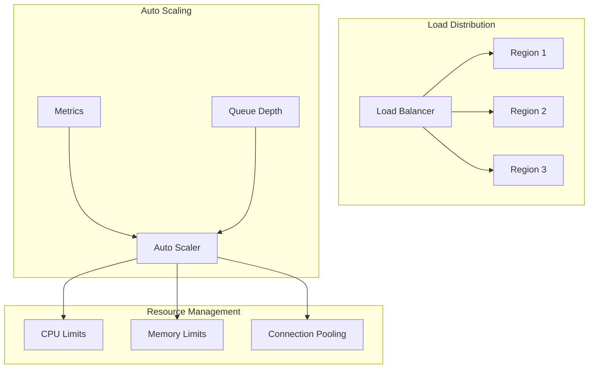

# System Architecture Overview

**Last Updated**: 2026-03-13
**Status**: Updated — see ADR-002

## High-Level Architecture

Release Regent is a containerised, event-driven service that processes GitHub webhooks to
automate release management workflows.

> **Note**: Earlier versions of this document described a serverless (Azure Functions / AWS
> Lambda) deployment model. That target has been superseded by a container-based deployment
> model. See [ADR-002](../../adr/ADR-002-long-running-server-deployment-model.md) for the
> rationale.

### Architecture Principles

**Event-Driven Processing**: All workflows triggered by GitHub webhook events
**Container-Based Deployment**: Runs as an OCI container in any container orchestration platform
**Idempotent Operations**: All operations safe to retry without side effects
**Single Responsibility**: Each component has a focused, well-defined purpose

### System Context

### Container View

## Component Architecture

### Processing Flow

### Core Components

#### 1. Server (Container Host)

**Purpose**: Long-running HTTP server hosting the webhook intake
**Technology**: Axum HTTP server (`crates/server`), deployed as an OCI container
**Responsibilities**:

- Receive and signature-validate incoming webhooks (via `github-bot-sdk`)
- Route validated events into the core processing pipeline
- Handle environment configuration and startup
- Expose health check endpoint for container orchestration probes

#### 2. Webhook Processor

**Purpose**: Event validation and routing
**Location**: `crates/core/src/webhook_processor.rs`
**Responsibilities**:

- Validate webhook signatures
- Parse and validate event payloads
- Route events to appropriate handlers
- Generate correlation IDs for tracing

#### 3. Release Orchestrator

**Purpose**: Coordinate release PR workflow
**Location**: `crates/core/src/release_orchestrator.rs`
**Responsibilities**:

- Process merged regular PRs
- Calculate semantic versions
- Orchestrate PR creation and updates
- Handle error recovery and logging

#### 4. Release Automator

**Purpose**: Create GitHub releases
**Location**: `crates/core/src/release_automator.rs`
**Responsibilities**:

- Process merged release PRs
- Extract version from PR information
- Create Git tags and GitHub releases
- Clean up release branches

#### 5. GitHub API Client

**Purpose**: All GitHub interactions
**Location**: `crates/github_client/src/`
**Responsibilities**:

- Authenticate with GitHub API
- Execute repository operations
- Handle rate limiting and retries
- Manage installation tokens

## Data Flow Architecture

### Webhook Processing Pipeline

### Release Creation Pipeline

## Integration Architecture

### External System Integrations

#### GitHub API Integration

**Authentication**: GitHub App with JWT and installation tokens
**Rate Limiting**: 5,000 requests per hour per installation
**Retry Strategy**: Exponential backoff with circuit breaker
**API Versions**: REST API v3 with GraphQL v4 for future enhancements

#### Secret Management Integration

**Azure**: Azure Key Vault with Managed Identity
**AWS**: AWS Secrets Manager with IAM roles
**Access Pattern**: On-demand retrieval with in-memory caching
**Rotation**: Automated rotation with zero-downtime updates

#### Configuration Management

**Storage**: YAML files in repository or centralized configuration
**Loading**: Hierarchical loading (app defaults → repo overrides)
**Validation**: Schema-based validation with clear error messages
**Hot Reload**: Configuration changes applied without restart

### Internal Component Integration

#### Service Communication

**Pattern**: Direct function calls within same process
**Error Handling**: Result types with explicit error propagation
**Tracing**: Correlation ID propagation across all components
**Testing**: Dependency injection for unit test isolation

#### Data Sharing

**Configuration**: Shared configuration context across components
**State**: Stateless design with all context passed explicitly
**Caching**: In-memory caching for GitHub tokens and repository metadata
**Persistence**: No persistent storage required

## Deployment Architecture

### Container Deployment

Release Regent runs as an OCI container image built from `crates/server`. It can be hosted on
any container orchestration platform (Kubernetes, Azure Container Apps, AWS ECS, Docker Compose).
See [ADR-002](../../adr/ADR-002-long-running-server-deployment-model.md) for the full rationale.

### Infrastructure Components

#### Compute Resources

**Container image**: Built with a multi-stage Dockerfile; final image is a minimal
`debian:bookworm-slim` or `distroless` image containing only the `rr-server` binary.

**Scaling**: Horizontal pod / task scaling driven by CPU or request-rate metrics.
A minimum of one replica is required; the application is stateless so any number of
replicas can run behind a load balancer.

**Health probes**:

- Liveness: `GET /` → HTTP 200
- Readiness: `GET /` → HTTP 200

#### Storage Resources

**Configuration Storage**: Git repositories or cloud configuration services
**Temporary Storage**: In-memory processing only (bounded `mpsc` channel)
**Log Storage**: Container stdout captured by the platform's native log aggregator

#### Network Resources

**Ingress / Load Balancer**: Routes HTTPS traffic from GitHub to the container; terminates TLS
**Private Networking**: Restrict egress to GitHub API endpoints; no inbound except webhook port
**Load Balancing**: Platform ingress controller (nginx, ALB, Azure Application Gateway)

## Security Architecture

### Defense in Depth

### Security Layers

#### Network Layer

- TLS 1.3 for all external communications
- Web Application Firewall for attack protection
- DDoS protection at cloud provider level
- Private networking for internal communications

#### Application Layer

- Webhook signature validation using HMAC-SHA256
- GitHub App authentication with short-lived tokens
- Input validation and sanitization
- Output encoding to prevent injection attacks

#### Data Layer

- Encryption in transit and at rest
- Sensitive data masking in logs
- Audit trail for all operations
- Data minimization principles

## Observability Architecture

### Monitoring Stack

### Telemetry Strategy

#### Structured Logging

- JSON format with consistent schema
- Correlation ID tracking across components
- Context-rich error information
- Performance timing for operations

#### Metrics Collection

- Business metrics (success rates, processing times)
- System metrics (memory, CPU, network)
- GitHub API metrics (rate limits, response times)
- Custom application metrics

#### Distributed Tracing

- Request lifecycle tracking
- Component interaction visualization
- Performance bottleneck identification
- Error context preservation

## Scalability Architecture

### Horizontal Scaling

### Scaling Strategies

#### Function Scaling

- Auto-scale based on queue depth and processing time
- Regional deployment for global availability
- Reserved capacity for critical operations
- Burst handling with overflow protection

#### Resource Optimization

- Memory and CPU allocation based on workload patterns
- Connection pooling for GitHub API calls
- Caching strategies for frequently accessed data
- Lazy loading of configuration and dependencies

#### Performance Optimization

- Asynchronous processing throughout
- Batch operations where possible
- Smart retry strategies with circuit breakers
- Efficient data structures and algorithms

## Future Architecture Considerations

### Extensibility Points

#### Plugin Architecture

- External versioning strategy plugins
- Custom notification handlers
- Template engine extensions
- Workflow customization hooks

#### Multi-Tenancy

- Repository isolation and security
- Per-tenant configuration and limits
- Billing and usage tracking
- Resource quota management

#### Advanced Features

- Multi-repository release coordination
- Advanced approval workflows
- Integration with external CI/CD systems
- Analytics and reporting capabilities
