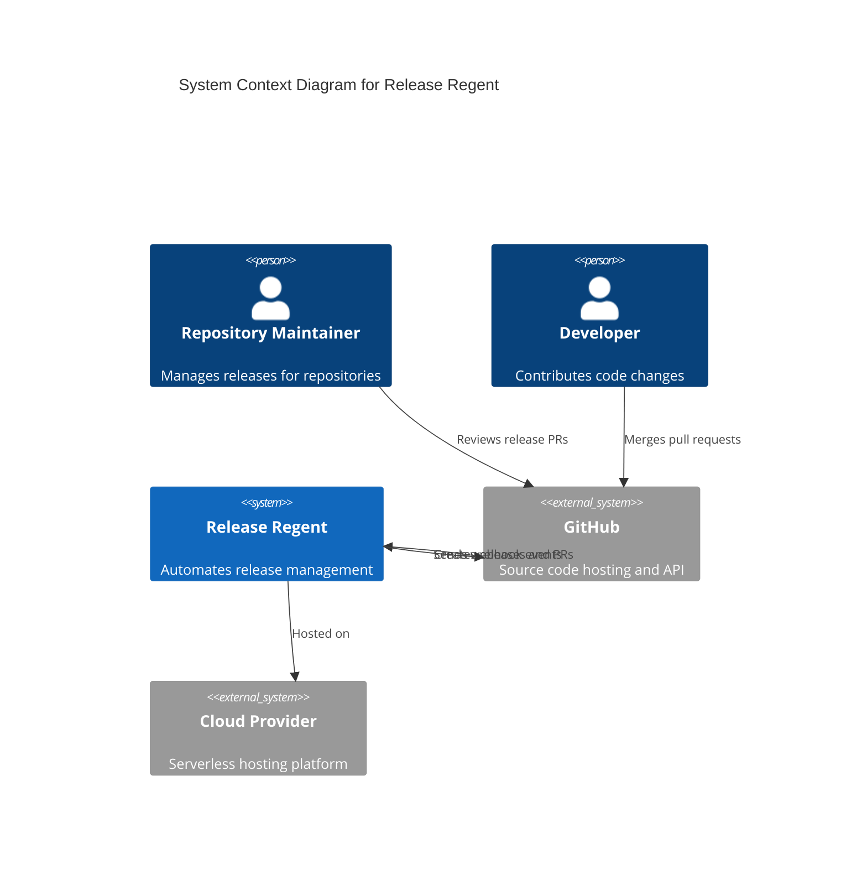
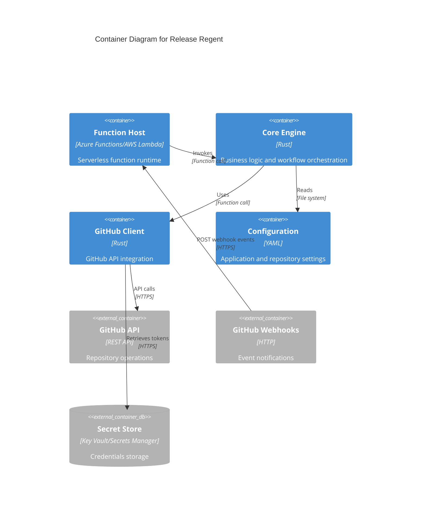
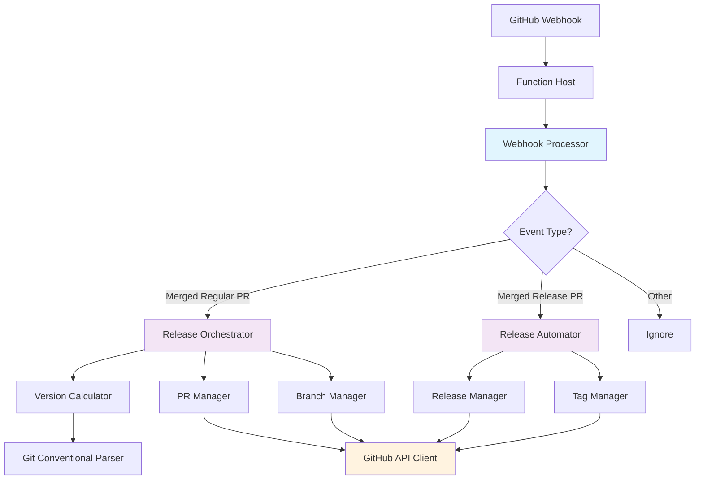
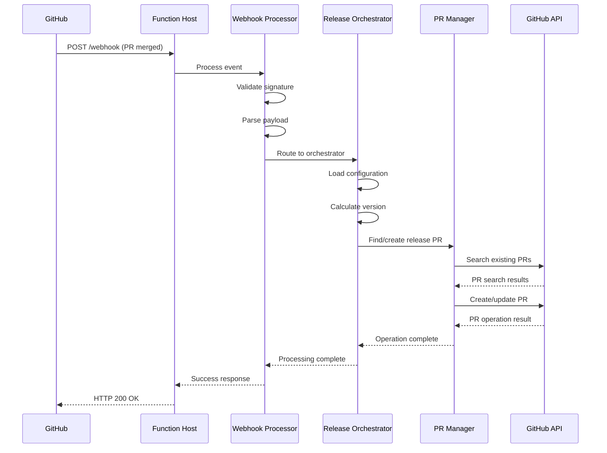
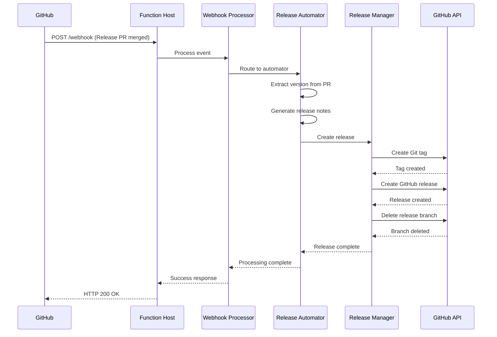
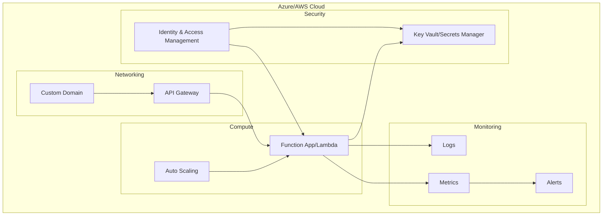
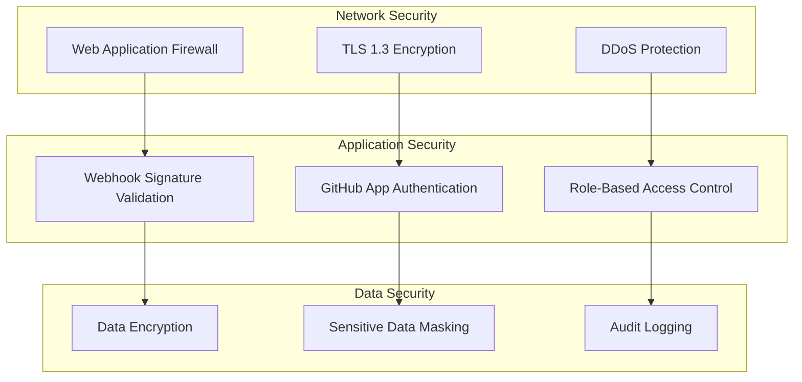
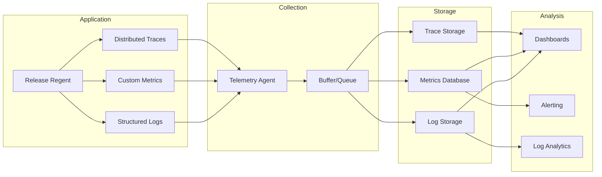
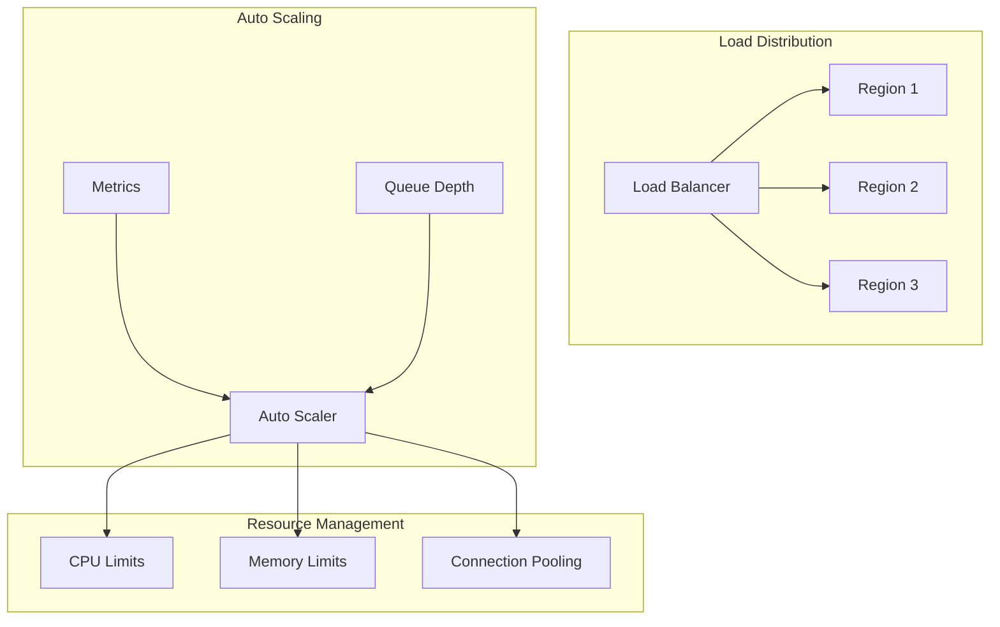

# System Architecture Overview

**Last Updated**: 2025-07-19
**Status**: Complete

## High-Level Architecture

Release Regent follows a serverless, event-driven architecture that processes GitHub webhooks to automate release management workflows.

### Architecture Principles

**Event-Driven Processing**: All workflows triggered by GitHub webhook events
**Serverless Design**: Stateless functions that auto-scale based on demand
**Idempotent Operations**: All operations safe to retry without side effects
**Single Responsibility**: Each component has a focused, well-defined purpose

### System Context

### Container View

## Component Architecture

### Processing Flow

### Core Components

#### 1. Function Host

**Purpose**: Serverless runtime environment
**Technology**: Azure Functions (Linux) or AWS Lambda
**Responsibilities**:

- Receive and validate incoming webhooks
- Route events to core processing engine
- Handle authentication and environment setup
- Manage function lifecycle and scaling

#### 2. Webhook Processor

**Purpose**: Event validation and routing
**Location**: `crates/core/src/webhook_processor.rs`
**Responsibilities**:

- Validate webhook signatures
- Parse and validate event payloads
- Route events to appropriate handlers
- Generate correlation IDs for tracing

#### 3. Release Orchestrator

**Purpose**: Coordinate release PR workflow
**Location**: `crates/core/src/release_orchestrator.rs`
**Responsibilities**:

- Process merged regular PRs
- Calculate semantic versions
- Orchestrate PR creation and updates
- Handle error recovery and logging

#### 4. Release Automator

**Purpose**: Create GitHub releases
**Location**: `crates/core/src/release_automator.rs`
**Responsibilities**:

- Process merged release PRs
- Extract version from PR information
- Create Git tags and GitHub releases
- Clean up release branches

#### 5. GitHub API Client

**Purpose**: All GitHub interactions
**Location**: `crates/github_client/src/`
**Responsibilities**:

- Authenticate with GitHub API
- Execute repository operations
- Handle rate limiting and retries
- Manage installation tokens

## Data Flow Architecture

### Webhook Processing Pipeline

### Release Creation Pipeline

## Integration Architecture

### External System Integrations

#### GitHub API Integration

**Authentication**: GitHub App with JWT and installation tokens
**Rate Limiting**: 5,000 requests per hour per installation
**Retry Strategy**: Exponential backoff with circuit breaker
**API Versions**: REST API v3 with GraphQL v4 for future enhancements

#### Secret Management Integration

**Azure**: Azure Key Vault with Managed Identity
**AWS**: AWS Secrets Manager with IAM roles
**Access Pattern**: On-demand retrieval with in-memory caching
**Rotation**: Automated rotation with zero-downtime updates

#### Configuration Management

**Storage**: YAML files in repository or centralized configuration
**Loading**: Hierarchical loading (app defaults → repo overrides)
**Validation**: Schema-based validation with clear error messages
**Hot Reload**: Configuration changes applied without restart

### Internal Component Integration

#### Service Communication

**Pattern**: Direct function calls within same process
**Error Handling**: Result types with explicit error propagation
**Tracing**: Correlation ID propagation across all components
**Testing**: Dependency injection for unit test isolation

#### Data Sharing

**Configuration**: Shared configuration context across components
**State**: Stateless design with all context passed explicitly
**Caching**: In-memory caching for GitHub tokens and repository metadata
**Persistence**: No persistent storage required

## Deployment Architecture

### Serverless Deployment

### Infrastructure Components

#### Compute Resources

**Azure Functions**:

- Consumption plan for automatic scaling
- Linux runtime for Rust application
- Application Insights for monitoring

**AWS Lambda**:

- On-demand scaling with reserved concurrency
- x86_64 runtime with custom runtime for Rust
- CloudWatch for logging and monitoring

#### Storage Resources

**Configuration Storage**: Git repositories or cloud configuration services
**Temporary Storage**: In-memory processing only
**Log Storage**: Cloud-native logging services with retention policies

#### Network Resources

**API Gateway**: Custom domain and SSL termination
**Private Networking**: VNet/VPC integration for security
**Load Balancing**: Built-in serverless load balancing

## Security Architecture

### Defense in Depth

### Security Layers

#### Network Layer

- TLS 1.3 for all external communications
- Web Application Firewall for attack protection
- DDoS protection at cloud provider level
- Private networking for internal communications

#### Application Layer

- Webhook signature validation using HMAC-SHA256
- GitHub App authentication with short-lived tokens
- Input validation and sanitization
- Output encoding to prevent injection attacks

#### Data Layer

- Encryption in transit and at rest
- Sensitive data masking in logs
- Audit trail for all operations
- Data minimization principles

## Observability Architecture

### Monitoring Stack

### Telemetry Strategy

#### Structured Logging

- JSON format with consistent schema
- Correlation ID tracking across components
- Context-rich error information
- Performance timing for operations

#### Metrics Collection

- Business metrics (success rates, processing times)
- System metrics (memory, CPU, network)
- GitHub API metrics (rate limits, response times)
- Custom application metrics

#### Distributed Tracing

- Request lifecycle tracking
- Component interaction visualization
- Performance bottleneck identification
- Error context preservation

## Scalability Architecture

### Horizontal Scaling

### Scaling Strategies

#### Function Scaling

- Auto-scale based on queue depth and processing time
- Regional deployment for global availability
- Reserved capacity for critical operations
- Burst handling with overflow protection

#### Resource Optimization

- Memory and CPU allocation based on workload patterns
- Connection pooling for GitHub API calls
- Caching strategies for frequently accessed data
- Lazy loading of configuration and dependencies

#### Performance Optimization

- Asynchronous processing throughout
- Batch operations where possible
- Smart retry strategies with circuit breakers
- Efficient data structures and algorithms

## Future Architecture Considerations

### Extensibility Points

#### Plugin Architecture

- External versioning strategy plugins
- Custom notification handlers
- Template engine extensions
- Workflow customization hooks

#### Multi-Tenancy

- Repository isolation and security
- Per-tenant configuration and limits
- Billing and usage tracking
- Resource quota management

#### Advanced Features

- Multi-repository release coordination
- Advanced approval workflows
- Integration with external CI/CD systems
- Analytics and reporting capabilities
