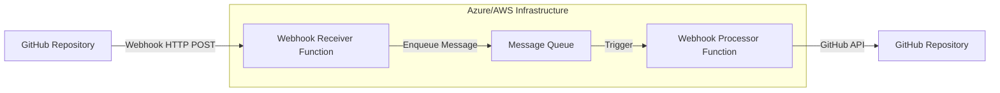

# Concurrency Control Design

**Last Updated**: 2025-07-19
**Status**: Updated for Serverless Architecture

## Overview

This document defines concurrency control mechanisms for Release Regent operating in serverless environments (Azure Functions and AWS Lambda) to prevent race conditions, handle concurrent webhook processing, and ensure data consistency without relying on in-memory state or background processes.

## Serverless Environment Constraints

### Stateless Execution Context

**No Shared Memory**: Each function invocation starts fresh with no access to previous execution state.

**No Background Tasks**: Cannot maintain long-running processes, queues, or locks between invocations.

**Execution Time Limits**:

- Azure Functions: 5-10 minute maximum execution time
- AWS Lambda: 15 minute maximum execution time

**Cold Start Latency**: Initial function startup may take 1-3 seconds for resource allocation.

### Concurrent Processing Requirements

**Sequential Processing per Repository**: Each repository's webhooks must be processed sequentially to prevent conflicts.

**Parallel Processing across Repositories**: Different repositories can be processed simultaneously.

**Idempotent Operations**: All operations must be safely retryable and produce consistent results.

**Race Condition Prevention**:

- Version conflicts: Prevent multiple PRs with same version
- Branch conflicts: Handle concurrent branch creation attempts
- API conflicts: Manage concurrent GitHub API operations safely

## Serverless Concurrency Control Strategy

### GitHub API Optimistic Locking

Rather than maintaining in-memory queues, leverage GitHub's built-in optimistic concurrency control:

```rust
use octocrab::models::pulls::PullRequest;
use serde_json::Value;

#[derive(Debug)]
pub struct ConditionalGitHubClient {
    octocrab: octocrab::Octocrab,
    owner: String,
    repo: String,
}

#[derive(Debug)]
pub struct VersionedResource<T> {
    pub data: T,
    pub etag: Option<String>,
    pub last_modified: Option<String>,
}

impl ConditionalGitHubClient {
    /// Get pull request with version headers for optimistic locking
    pub async fn get_pr_with_version(&self, pr_number: u64) -> Result<VersionedResource<PullRequest>, GitHubError> {
        let response = self.octocrab
            .pulls(&self.owner, &self.repo)
            .get(pr_number)
            .send_with_headers()
            .await?;

        let etag = response.headers()
            .get("etag")
            .and_then(|v| v.to_str().ok())
            .map(|s| s.trim_matches('"').to_string()); // Remove quotes from ETag

        let last_modified = response.headers()
            .get("last-modified")
            .and_then(|v| v.to_str().ok())
            .map(|s| s.to_string());

        Ok(VersionedResource {
            data: response.into_body(),
            etag,
            last_modified,
        })
    }

    /// Update pull request with conditional headers to prevent conflicts
    pub async fn update_pr_conditional(
        &self,
        pr_number: u64,
        versioned_pr: &VersionedResource<PullRequest>,
        updates: &PullRequestUpdate
    ) -> Result<VersionedResource<PullRequest>, ConcurrencyError> {
        let mut request = self.octocrab
            .pulls(&self.owner, &self.repo)
            .update(pr_number);

        // Add conditional headers for optimistic locking
        if let Some(etag) = &versioned_pr.etag {
            request = request.header("If-Match", format!("\"{}\"", etag));
        }

        if let Some(last_modified) = &versioned_pr.last_modified {
            request = request.header("If-Unmodified-Since", last_modified);
        }

        // Apply updates
        if let Some(title) = &updates.title {
            request = request.title(title);
        }
        if let Some(body) = &updates.body {
            request = request.body(body);
        }

        match request.send_with_headers().await {
            Ok(response) => {
                let new_etag = response.headers()
                    .get("etag")
                    .and_then(|v| v.to_str().ok())
                    .map(|s| s.trim_matches('"').to_string());

                let new_last_modified = response.headers()
                    .get("last-modified")
                    .and_then(|v| v.to_str().ok())
                    .map(|s| s.to_string());

                Ok(VersionedResource {
                    data: response.into_body(),
                    etag: new_etag,
                    last_modified: new_last_modified,
                })
            }
            Err(octocrab::Error::GitHub { source, .. }) if source.status_code == 412 => {
                // Precondition Failed - someone else modified the PR
                Err(ConcurrencyError::OptimisticLockFailure {
                    resource: "pull_request".to_string(),
                    resource_id: pr_number.to_string(),
                })
            }
            Err(e) => Err(ConcurrencyError::GitHubApiError(e))
        }
    }

    /// Create branch with conflict detection
    pub async fn create_branch_safe(&self, branch_name: &str, sha: &str) -> Result<(), ConcurrencyError> {
        match self.octocrab
            .repos(&self.owner, &self.repo)
            .create_ref(&format!("refs/heads/{}", branch_name), sha)
            .await {
                Ok(_) => Ok(()),
                Err(octocrab::Error::GitHub { source, .. }) if source.status_code == 422 => {
                    // Branch already exists - check if we can use fallback naming
                    Err(ConcurrencyError::BranchConflict {
                        branch_name: branch_name.to_string(),
                        suggested_fallback: generate_fallback_branch_name(branch_name),
                    })
                }
                Err(e) => Err(ConcurrencyError::GitHubApiError(e))
            }
    }
}

fn generate_fallback_branch_name(original_branch: &str) -> String {
    let timestamp = std::time::SystemTime::now()
        .duration_since(std::time::UNIX_EPOCH)
        .unwrap()
        .as_secs();
    format!("{}-{}", original_branch, timestamp)
}
```

### Idempotent Webhook Processing

Each webhook processing function must be designed to handle duplicate invocations safely:

```rust
#[derive(Debug)]
pub struct IdempotentWebhookProcessor {
    github_client: ConditionalGitHubClient,
    config: ProcessingConfig,
}

impl IdempotentWebhookProcessor {
    pub async fn process_merged_pr(&self, event: WebhookEvent) -> Result<ProcessingResult, ProcessingError> {
        let correlation_id = event.correlation_id.clone();

        // Step 1: Check if release PR already exists for this merge
        if let Some(existing_pr) = self.find_existing_release_pr(&event).await? {
            info!("Release PR already exists, updating instead of creating",
                  correlation_id = correlation_id,
                  existing_pr_number = existing_pr.number);

            return self.update_existing_release_pr(existing_pr, &event).await;
        }

        // Step 2: Calculate version with conflict detection
        let version = self.calculate_version_safe(&event).await?;

        // Step 3: Create release branch with fallback naming
        let branch_name = self.create_release_branch_safe(&event, &version).await?;

        // Step 4: Create release PR with optimistic locking
        let pr = self.create_release_pr_safe(&event, &version, &branch_name).await?;

        Ok(ProcessingResult::Created {
            pr_number: pr.number,
            version: version.to_string(),
            branch_name,
            correlation_id,
        })
    }

    async fn find_existing_release_pr(&self, event: &WebhookEvent) -> Result<Option<PullRequest>, ProcessingError> {
        // Search for existing release PRs that might conflict
        let prs = self.github_client
            .search_pull_requests(&format!(
                "repo:{}/{} is:open head:release/",
                event.repository.owner,
                event.repository.name
            ))
            .await?;

        // Look for PRs that would conflict with this merge
        for pr in prs {
            if self.pr_conflicts_with_merge(&pr, event).await? {
                return Ok(Some(pr));
            }
        }

        Ok(None)
    }

    async fn create_release_branch_safe(
        &self,
        event: &WebhookEvent,
        version: &semver::Version
    ) -> Result<String, ProcessingError> {
        let base_branch_name = format!("release/v{}", version);
        let target_sha = &event.pull_request.merge_commit_sha;

        // Try to create branch with standard name
        match self.github_client.create_branch_safe(&base_branch_name, target_sha).await {
            Ok(_) => Ok(base_branch_name),
            Err(ConcurrencyError::BranchConflict { suggested_fallback, .. }) => {
                info!("Branch name conflict, using fallback",
                      original = base_branch_name,
                      fallback = suggested_fallback,
                      correlation_id = event.correlation_id);

                // Try fallback name
                self.github_client.create_branch_safe(&suggested_fallback, target_sha).await
                    .map_err(ProcessingError::from)?;

                Ok(suggested_fallback)
            }
            Err(e) => Err(ProcessingError::from(e))
        }
    }
}
```

### External Queue Integration (Optional)

For high-volume scenarios or when strict per-repository ordering is required, consider external queue services. This requires a two-function architecture where GitHub webhooks are received by one function and processed by another.

## Queue-Based Architecture Overview



**Benefits of Queue-Based Processing**:

- **Per-repository ordering**: FIFO queues ensure sequential processing per repository
- **Reliability**: Built-in retry mechanisms and dead letter queues
- **Scalability**: Automatic scaling based on queue depth
- **Observability**: Cloud-native monitoring and alerting

**Trade-offs**:

- **Complexity**: Requires two functions instead of one
- **Latency**: Additional hop adds ~50-200ms processing delay
- **Cost**: Queue operations incur additional charges
- **Infrastructure**: More moving parts to manage

## Azure Implementation

### Infrastructure Setup

```yaml
# Azure Resource Manager Template
resources:
  - type: Microsoft.ServiceBus/namespaces
    name: release-regent-servicebus
    properties:
      sku:
        name: Standard  # Required for partitioning

  - type: Microsoft.ServiceBus/namespaces/queues
    name: release-regent-servicebus/webhook-events
    properties:
      maxDeliveryCount: 5
      lockDuration: PT60S
      enablePartitioning: true  # For per-repository ordering
      deadLetteringOnMessageExpiration: true

  - type: Microsoft.Web/sites
    name: release-regent-webhook-receiver
    properties:
      kind: functionapp

  - type: Microsoft.Web/sites
    name: release-regent-webhook-processor
    properties:
      kind: functionapp
```

### Function 1: Webhook Receiver (HTTP Trigger)

```rust
use azure_functions::prelude::*;
use azure_service_bus::prelude::*;

#[azure_functions::func]
pub async fn receive_github_webhook(
    #[azure_functions::http_trigger(
        name = "webhook",
        methods = "post",
        route = "webhook"
    )]
    req: HttpRequest,
    context: Context,
) -> Result<HttpResponse, Box<dyn std::error::Error + Send + Sync>> {
    let correlation_id = uuid::Uuid::new_v4().to_string();

    // Validate GitHub webhook signature
    let signature = req.headers()
        .get("X-Hub-Signature-256")
        .and_then(|h| h.to_str().ok())
        .ok_or("Missing webhook signature")?;

    let body = req.body().bytes().await?;

    if !validate_github_signature(&body, signature)? {
        return Ok(HttpResponse::builder()
            .status(401)
            .body("Invalid signature")?);
    }

    // Parse webhook event
    let webhook_event: GitHubWebhookEvent = serde_json::from_slice(&body)?;

    // Only process pull_request.closed events
    if webhook_event.action != "closed" || !webhook_event.pull_request.merged.unwrap_or(false) {
        return Ok(HttpResponse::builder()
            .status(200)
            .body("Event ignored")?);
    }

    // Create internal webhook event
    let internal_event = WebhookEvent {
        correlation_id: correlation_id.clone(),
        repository: webhook_event.repository,
        pull_request: webhook_event.pull_request,
        action: webhook_event.action,
        received_at: chrono::Utc::now(),
    };

    // Send to Service Bus queue
    let connection_string = std::env::var("AZURE_SERVICEBUS_CONNECTION_STRING")?;
    let queue_client = QueueClient::new(connection_string, "webhook-events").await?;

    let message = ServiceBusMessage::new(serde_json::to_vec(&internal_event)?)
        .with_correlation_id(&correlation_id)
        .with_session_id(&internal_event.repository.full_name); // For per-repo ordering

    queue_client.send_message(message).await?;

    info!("Webhook enqueued successfully",
          correlation_id = correlation_id,
          repository = internal_event.repository.full_name);

    Ok(HttpResponse::builder()
        .status(200)
        .body("Webhook received and queued")?)
}
```

### Function 2: Webhook Processor (Service Bus Trigger)

```rust
#[azure_functions::func]
pub async fn process_webhook_from_queue(
    #[azure_functions::service_bus_queue_trigger(
        name = "webhook_event",
        connection = "AZURE_SERVICEBUS_CONNECTION_STRING",
        queue_name = "webhook-events"
    )]
    webhook_event: String,
    context: Context,
) -> Result<(), ProcessingError> {
    let correlation_id = context.invocation_id().to_string();
    let event: WebhookEvent = serde_json::from_str(&webhook_event)?;

    info!("Processing webhook from queue",
          correlation_id = correlation_id,
          repository = event.repository.full_name);

    let processor = IdempotentWebhookProcessor::new(
        ConditionalGitHubClient::from_environment()?,
        correlation_id,
    );

    match processor.process_merged_pr(event.clone()).await {
        Ok(result) => {
            info!("Webhook processed successfully",
                  correlation_id = correlation_id,
                  result = ?result);
            Ok(())
        }
        Err(error) => {
            error!("Webhook processing failed",
                   correlation_id = correlation_id,
                   repository = event.repository.full_name,
                   error = ?error);
            Err(error)
        }
    }
}
```

## AWS Implementation

### Infrastructure Setup

```yaml
# AWS CloudFormation Template
Resources:
  WebhookQueue:
    Type: AWS::SQS::Queue
    Properties:
      QueueName: release-regent-webhooks.fifo
      FifoQueue: true
      ContentBasedDeduplication: true
      VisibilityTimeoutSeconds: 300  # 5 minutes
      MessageRetentionPeriod: 1209600  # 14 days
      ReceiveMessageWaitTimeSeconds: 20  # Long polling
      RedrivePolicy:
        deadLetterTargetArn: !GetAtt WebhookDeadLetterQueue.Arn
        maxReceiveCount: 5

  WebhookDeadLetterQueue:
    Type: AWS::SQS::Queue
    Properties:
      QueueName: release-regent-webhooks-dlq.fifo
      FifoQueue: true
      MessageRetentionPeriod: 1209600  # 14 days

  WebhookReceiverFunction:
    Type: AWS::Lambda::Function
    Properties:
      FunctionName: release-regent-webhook-receiver
      Runtime: provided.al2
      Handler: bootstrap
      Environment:
        Variables:
          WEBHOOK_QUEUE_URL: !Ref WebhookQueue
          GITHUB_WEBHOOK_SECRET: !Ref GitHubWebhookSecret

  WebhookProcessorFunction:
    Type: AWS::Lambda::Function
    Properties:
      FunctionName: release-regent-webhook-processor
      Runtime: provided.al2
      Handler: bootstrap
      ReservedConcurrencyLimit: 10  # Limit concurrent executions

  WebhookProcessorEventSourceMapping:
    Type: AWS::Lambda::EventSourceMapping
    Properties:
      EventSourceArn: !GetAtt WebhookQueue.Arn
      FunctionName: !Ref WebhookProcessorFunction
      BatchSize: 1  # Process one message at a time
      MaximumBatchingWindowInSeconds: 0
```

### Function 1: Webhook Receiver (API Gateway + Lambda)

```rust
use lambda_runtime::{service_fn, LambdaEvent, Error};
use lambda_web::{is_running_on_lambda, run, RequestExt};
use aws_sdk_sqs::Client as SqsClient;

pub async fn webhook_receiver_handler(
    event: LambdaEvent<lambda_web::Request>,
    _context: lambda_runtime::Context,
) -> Result<lambda_web::Response<String>, Error> {
    let correlation_id = uuid::Uuid::new_v4().to_string();

    // Validate GitHub webhook signature
    let signature = event.payload.headers()
        .get("x-hub-signature-256")
        .and_then(|h| h.to_str().ok())
        .ok_or("Missing webhook signature")?;

    let body = event.payload.body();

    if !validate_github_signature(body.as_bytes(), signature)? {
        return Ok(lambda_web::Response::builder()
            .status(401)
            .body("Invalid signature".to_string())?);
    }

    // Parse webhook event
    let webhook_event: GitHubWebhookEvent = serde_json::from_str(body)?;

    // Only process pull_request.closed events
    if webhook_event.action != "closed" || !webhook_event.pull_request.merged.unwrap_or(false) {
        return Ok(lambda_web::Response::builder()
            .status(200)
            .body("Event ignored".to_string())?);
    }

    // Create internal webhook event
    let internal_event = WebhookEvent {
        correlation_id: correlation_id.clone(),
        repository: webhook_event.repository,
        pull_request: webhook_event.pull_request,
        action: webhook_event.action,
        received_at: chrono::Utc::now(),
    };

    // Send to SQS FIFO queue
    let config = aws_config::load_from_env().await;
    let sqs_client = SqsClient::new(&config);
    let queue_url = std::env::var("WEBHOOK_QUEUE_URL")?;

    sqs_client
        .send_message()
        .queue_url(&queue_url)
        .message_body(serde_json::to_string(&internal_event)?)
        .message_group_id(&internal_event.repository.full_name) // Per-repo ordering
        .message_deduplication_id(&correlation_id) // Prevent duplicates
        .send()
        .await?;

    tracing::info!("Webhook enqueued successfully",
                   correlation_id = correlation_id,
                   repository = internal_event.repository.full_name);

    Ok(lambda_web::Response::builder()
        .status(200)
        .body("Webhook received and queued".to_string())?)
}
```

### Function 2: Webhook Processor (SQS Trigger)

```rust
pub async fn webhook_processor_handler(
    event: LambdaEvent<SqsEvent>,
    _context: lambda_runtime::Context,
) -> Result<(), lambda_runtime::Error> {
    for record in event.payload.records {
        let correlation_id = record.message_id.unwrap_or_default();

        if let Some(body) = record.body {
            let webhook_event: WebhookEvent = serde_json::from_str(&body)?;

            tracing::info!("Processing webhook from SQS",
                          correlation_id = correlation_id,
                          repository = webhook_event.repository.full_name);

            let processor = IdempotentWebhookProcessor::new(
                ConditionalGitHubClient::from_environment()?,
                correlation_id.clone(),
            );

            match processor.process_merged_pr(webhook_event.clone()).await {
                Ok(result) => {
                    tracing::info!("Webhook processed successfully",
                                  correlation_id = correlation_id,
                                  result = ?result);
                }
                Err(error) => {
                    tracing::error!("Webhook processing failed",
                                   correlation_id = correlation_id,
                                   repository = webhook_event.repository.full_name,
                                   error = ?error);
                    return Err(lambda_runtime::Error::from(error));
                }
            }
        }
    }
    Ok(())
}
```

## Configuration

```yaml
# Application configuration for queue-based processing
queue_processing:
  enabled: true
  platform: "azure"  # or "aws"

  azure:
    service_bus_connection_string: ${AZURE_SERVICEBUS_CONNECTION_STRING}
    queue_name: "webhook-events"
    receiver_function_url: "https://release-regent-receiver.azurewebsites.net/api/webhook"

  aws:
    sqs_queue_url: ${AWS_SQS_QUEUE_URL}
    receiver_function_url: "https://api-id.execute-api.region.amazonaws.com/prod/webhook"

  # Processing settings
  batch_size: 1  # Always 1 for FIFO ordering
  max_processing_time_seconds: 300
  retry_attempts: 5

  # Dead letter queue monitoring
  dlq_alert_threshold: 10
  dlq_check_interval_minutes: 15
```

## GitHub Webhook Configuration

When using queue-based processing, configure GitHub webhooks to point to the **receiver function**, not the processor:

```bash
# Azure example
curl -X POST \
  https://api.github.com/repos/owner/repo/hooks \
  -H "Authorization: token $GITHUB_TOKEN" \
  -d '{
    "name": "web",
    "config": {
      "url": "https://release-regent-receiver.azurewebsites.net/api/webhook",
      "content_type": "json",
      "secret": "your-webhook-secret"
    },
    "events": ["pull_request"],
    "active": true
  }'

# AWS example
curl -X POST \
  https://api.github.com/repos/owner/repo/hooks \
  -H "Authorization: token $GITHUB_TOKEN" \
  -d '{
    "name": "web",
    "config": {
      "url": "https://api-id.execute-api.region.amazonaws.com/prod/webhook",
      "content_type": "json",
      "secret": "your-webhook-secret"
    },
    "events": ["pull_request"],
    "active": true
  }'
```

## Monitoring and Alerting

Both platforms provide built-in monitoring for queue-based architectures:

**Azure Monitor**:

- Service Bus queue depth and throughput metrics
- Function execution logs and performance metrics
- Dead letter queue alerts

**AWS CloudWatch**:

- SQS queue depth and age of oldest message metrics
- Lambda execution duration and error rate metrics
- Dead letter queue message count alerts

This queue-based architecture provides the highest level of reliability and per-repository ordering guarantees, at the cost of additional infrastructure complexity.

### Version Conflict Resolution

```rust
#[derive(Debug, PartialEq)]
pub enum VersionConflictResolution {
    UseHigherVersion,
    MergeChangelogs,
    SkipUpdate,
    CreateNewPR,
}

pub struct VersionConflictResolver;

impl VersionConflictResolver {
    pub fn resolve_conflict(
        existing_version: &SemanticVersion,
        calculated_version: &SemanticVersion,
        force_update: bool
    ) -> VersionConflictResolution {
        use std::cmp::Ordering;

        match calculated_version.cmp(existing_version) {
            Ordering::Greater => VersionConflictResolution::UseHigherVersion,
            Ordering::Equal => VersionConflictResolution::MergeChangelogs,
            Ordering::Less => {
                if force_update {
                    VersionConflictResolution::UseHigherVersion
                } else {
                    VersionConflictResolution::SkipUpdate
                }
            }
        }
    }

    pub async fn apply_resolution(
        &self,
        resolution: VersionConflictResolution,
        existing_pr: &VersionedPullRequest,
        new_version: &SemanticVersion,
        new_changelog: &str,
        pr_manager: &PullRequestManager
    ) -> Result<PullRequestOperation, ConflictError> {
        match resolution {
            VersionConflictResolution::UseHigherVersion => {
                // Update PR with new version and changelog
                let updates = PullRequestUpdate {
                    title: format!("chore(release): {}", new_version),
                    body: self.generate_pr_body(new_version, new_changelog)?,
                };

                // May need to rename branch if version changed significantly
                if self.should_rename_branch(&existing_pr.pr, new_version) {
                    self.rename_pr_branch(&existing_pr.pr, new_version, pr_manager).await?;
                }

                let updated_pr = pr_manager.update_pr_conditional(existing_pr, &updates).await?;
                Ok(PullRequestOperation::Updated(updated_pr))
            }

            VersionConflictResolution::MergeChangelogs => {
                // Extract existing changelog and merge with new one
                let existing_changelog = self.extract_changelog_from_pr(&existing_pr.pr)?;
                let merged_changelog = self.merge_changelogs(&existing_changelog, new_changelog)?;

                let updates = PullRequestUpdate {
                    title: existing_pr.pr.title.clone().unwrap_or_default(),
                    body: self.generate_pr_body(
                        &self.extract_version_from_pr(&existing_pr.pr)?,
                        &merged_changelog
                    )?,
                };

                let updated_pr = pr_manager.update_pr_conditional(existing_pr, &updates).await?;
                Ok(PullRequestOperation::Updated(updated_pr))
            }

            VersionConflictResolution::SkipUpdate => {
                warn!("Skipping PR update - calculated version {} lower than existing {}",
                      new_version, self.extract_version_from_pr(&existing_pr.pr)?);
                Ok(PullRequestOperation::Skipped)
            }

            VersionConflictResolution::CreateNewPR => {
                // This would be used for more advanced scenarios
                unimplemented!("Creating multiple release PRs not currently supported")
            }
        }
    }
}
```

### Branch Conflict Handling

```rust
pub struct BranchManager {
    github_client: Arc<GitHubApiClient>,
    naming_strategy: BranchNamingStrategy,
}

#[derive(Debug)]
pub enum BranchNamingStrategy {
    Standard,           // release/v{version}
    Timestamped,        // release/v{version}-{timestamp}
    Uuid,              // release/v{version}-{uuid}
}

impl BranchManager {
    pub async fn create_release_branch(
        &self,
        version: &SemanticVersion,
        base_branch: &str
    ) -> Result<String, BranchError> {
        let mut attempts = 0;
        let max_attempts = 5;

        while attempts < max_attempts {
            let branch_name = self.generate_branch_name(version, attempts);

            match self.github_client.create_branch(&branch_name, base_branch).await {
                Ok(_) => return Ok(branch_name),
                Err(GitHubError::BranchAlreadyExists) => {
                    attempts += 1;
                    warn!("Branch {} already exists, trying alternative name", branch_name);
                    continue;
                }
                Err(error) => return Err(BranchError::CreationFailed(error)),
            }
        }

        Err(BranchError::TooManyAttempts {
            version: version.clone(),
            attempts: max_attempts,
        })
    }

    fn generate_branch_name(&self, version: &SemanticVersion, attempt: u32) -> String {
        let base_name = format!("release/v{}", version);

        match attempt {
            0 => base_name,
            _ => match self.naming_strategy {
                BranchNamingStrategy::Standard => base_name,
                BranchNamingStrategy::Timestamped => {
                    let timestamp = chrono::Utc::now().timestamp();
                    format!("{}-{}", base_name, timestamp)
                }
                BranchNamingStrategy::Uuid => {
                    let uuid = uuid::Uuid::new_v4();
                    format!("{}-{}", base_name, &uuid.to_string()[..8])
                }
            }
        }
    }

    pub async fn rename_pr_branch(
        &self,
        pr: &PullRequest,
        new_version: &SemanticVersion
    ) -> Result<String, BranchError> {
        let new_branch_name = self.create_release_branch(new_version, &pr.base.ref_field).await?;

        // GitHub doesn't support direct branch renaming, so we:
        // 1. Create new branch from current head
        // 2. Update PR to point to new branch
        // 3. Delete old branch

        // Create new branch pointing to current head
        let current_sha = &pr.head.sha;
        self.github_client.create_branch_from_sha(&new_branch_name, current_sha).await?;

        // Update PR to use new branch
        self.github_client.update_pr_base_branch(pr.number, &new_branch_name).await?;

        // Delete old branch (best effort - don't fail if this doesn't work)
        if let Err(error) = self.github_client.delete_branch(&pr.head.ref_field).await {
            warn!("Failed to delete old release branch {}: {}", pr.head.ref_field, error);
        }

        Ok(new_branch_name)
    }
}
```

### Dead Letter Queue for Failed Events

```rust
pub struct DeadLetterQueue {
    storage: Box<dyn DeadLetterStorage>,
    max_retention_hours: u32,
}

#[derive(Debug, Clone)]
pub struct DeadLetter {
    pub id: Uuid,
    pub original_event: WebhookEvent,
    pub failure_reason: String,
    pub attempt_count: u32,
    pub first_attempt: DateTime<Utc>,
    pub last_attempt: DateTime<Utc>,
    pub correlation_id: String,
}

impl DeadLetterQueue {
    pub async fn store_failed_event(
        &self,
        event: WebhookEvent,
        error: &ProcessingError,
        attempt_count: u32
    ) -> Result<(), StorageError> {
        let dead_letter = DeadLetter {
            id: Uuid::new_v4(),
            original_event: event.clone(),
            failure_reason: error.to_string(),
            attempt_count,
            first_attempt: event.received_at,
            last_attempt: Utc::now(),
            correlation_id: event.correlation_id,
        };

        self.storage.store(dead_letter).await?;

        warn!("Event moved to dead letter queue",
              correlation_id = dead_letter.correlation_id,
              repository = format!("{}/{}",
                  event.repository.owner,
                  event.repository.name),
              attempt_count = attempt_count,
              failure_reason = error.to_string());

        Ok(())
    }

    pub async fn retry_events(
        &self,
        filter: DeadLetterFilter,
        processor: &dyn WebhookProcessor
    ) -> Result<RetryResult, StorageError> {
        let events = self.storage.list_events(&filter).await?;
        let mut successful = 0;
        let mut failed = 0;

        for dead_letter in events {
            match processor.process_webhook(dead_letter.original_event.clone()).await {
                Ok(_) => {
                    self.storage.mark_resolved(&dead_letter.id).await?;
                    successful += 1;
                    info!("Successfully retried dead letter event",
                          correlation_id = dead_letter.correlation_id);
                }
                Err(error) => {
                    failed += 1;
                    error!("Failed to retry dead letter event",
                           correlation_id = dead_letter.correlation_id,
                           error = ?error);
                }
            }
        }

        Ok(RetryResult { successful, failed })
    }
}
```

## Monitoring and Observability

### Queue Metrics

```rust
#[derive(Debug, Default)]
pub struct QueueMetrics {
    pub total_events_queued: u64,
    pub total_events_processed: u64,
    pub total_events_failed: u64,
    pub current_queue_depth: u32,
    pub active_repositories: u32,
    pub average_processing_time_ms: f64,
    pub dead_letter_count: u32,
}

pub struct QueueMonitor {
    metrics: Arc<Mutex<QueueMetrics>>,
    last_update: Arc<Mutex<Instant>>,
}

impl QueueMonitor {
    pub async fn record_event_queued(&self, repository: &str) {
        let mut metrics = self.metrics.lock().await;
        metrics.total_events_queued += 1;
        metrics.current_queue_depth += 1;
    }

    pub async fn record_event_processed(&self, repository: &str, duration: Duration) {
        let mut metrics = self.metrics.lock().await;
        metrics.total_events_processed += 1;
        metrics.current_queue_depth = metrics.current_queue_depth.saturating_sub(1);

        // Update moving average processing time
        let duration_ms = duration.as_millis() as f64;
        metrics.average_processing_time_ms =
            (metrics.average_processing_time_ms * 0.9) + (duration_ms * 0.1);
    }

    pub async fn get_metrics(&self) -> QueueMetrics {
        self.metrics.lock().await.clone()
    }
}
```

### Alerts and Thresholds

```rust
pub struct ConcurrencyAlerts {
    queue_depth_threshold: u32,        // Alert if queue depth > 50
    processing_time_threshold: u64,    // Alert if avg processing > 30s
    dead_letter_threshold: u32,        // Alert if dead letters > 10
    error_rate_threshold: f64,         // Alert if error rate > 10%
}

impl ConcurrencyAlerts {
    pub async fn check_thresholds(&self, metrics: &QueueMetrics) -> Vec<Alert> {
        let mut alerts = Vec::new();

        if metrics.current_queue_depth > self.queue_depth_threshold {
            alerts.push(Alert::HighQueueDepth {
                current: metrics.current_queue_depth,
                threshold: self.queue_depth_threshold,
            });
        }

        if metrics.average_processing_time_ms > self.processing_time_threshold as f64 {
            alerts.push(Alert::SlowProcessing {
                current_ms: metrics.average_processing_time_ms,
                threshold_ms: self.processing_time_threshold,
            });
        }

        if metrics.dead_letter_count > self.dead_letter_threshold {
            alerts.push(Alert::HighDeadLetterCount {
                current: metrics.dead_letter_count,
                threshold: self.dead_letter_threshold,
            });
        }

        let error_rate = if metrics.total_events_processed > 0 {
            metrics.total_events_failed as f64 / metrics.total_events_processed as f64
        } else {
            0.0
        };

        if error_rate > self.error_rate_threshold {
            alerts.push(Alert::HighErrorRate {
                current_rate: error_rate,
                threshold_rate: self.error_rate_threshold,
            });
        }

        alerts
    }
}
```

## Testing Concurrency

### Race Condition Tests

```rust
#[cfg(test)]
mod concurrency_tests {
    use super::*;
    use tokio::time::{sleep, Duration};

    #[tokio::test]
    async fn test_concurrent_webhook_processing() {
        let manager = WebhookQueueManager::new(test_config());
        let repo_key = "owner/repo";

        // Create multiple concurrent events for the same repository
        let events: Vec<_> = (0..10)
            .map(|i| create_test_webhook_event(repo_key, i))
            .collect();

        // Enqueue all events concurrently
        let enqueue_tasks: Vec<_> = events.into_iter()
            .map(|event| manager.enqueue_event(event))
            .collect();

        let results = futures::future::join_all(enqueue_tasks).await;

        // All events should be queued successfully
        for result in results {
            assert!(result.is_ok());
        }

        // Wait for processing to complete
        sleep(Duration::from_secs(5)).await;

        // Verify all events were processed sequentially
**Azure Service Bus / Amazon SQS Integration**:

```yaml
# Azure Functions with Service Bus
azure_queue:
  connection_string: ${AZURE_SERVICEBUS_CONNECTION_STRING}
  queue_name: "release-regent-webhooks"
  max_delivery_count: 5
  lock_duration: "PT60S"  # 60 seconds

  # Partition by repository for ordering
  partition_key_expression: "repository.full_name"

  # Function scaling settings
  batch_size: 1  # Process one webhook at a time per repository
  max_concurrent_calls: 10  # Up to 10 repositories in parallel

# AWS Lambda with SQS
aws_queue:
  queue_url: ${AWS_SQS_QUEUE_URL}
  visibility_timeout: 60
  max_receive_count: 5

  # FIFO queue for ordering per repository
  fifo_queue: true
  message_group_id_expression: "repository.full_name"

  # Lambda scaling settings
  batch_size: 1
  maximum_batching_window_in_seconds: 0
  reserved_concurrency: 10
```

**Queue-Based Processing Flow**:

```rust
// Azure Functions integration
#[azure_functions::func]
pub async fn process_webhook_from_queue(
    #[azure_functions::service_bus_queue_trigger(
        name = "webhook_event",
        connection = "AZURE_SERVICEBUS_CONNECTION_STRING",
        queue_name = "release-regent-webhooks"
    )]
    webhook_event: String,
    context: Context,
) -> Result<(), ProcessingError> {
    let correlation_id = context.invocation_id().to_string();
    let event: WebhookEvent = serde_json::from_str(&webhook_event)?;

    let processor = IdempotentWebhookProcessor::new(
        ConditionalGitHubClient::from_environment()?,
        correlation_id,
    );

    processor.process_merged_pr(event).await
}

// AWS Lambda integration
pub async fn lambda_handler(
    event: LambdaEvent<SqsEvent>,
    _context: lambda_runtime::Context,
) -> Result<(), lambda_runtime::Error> {
    for record in event.payload.records {
        if let Some(body) = record.body {
            let webhook_event: WebhookEvent = serde_json::from_str(&body)?;
            let correlation_id = record.message_id.unwrap_or_default();

            let processor = IdempotentWebhookProcessor::new(
                ConditionalGitHubClient::from_environment()?,
                correlation_id,
            );

            processor.process_merged_pr(webhook_event).await?;
        }
    }
    Ok(())
}
```

## Error Handling and Recovery

### Concurrency Error Types

```rust
#[derive(Debug, thiserror::Error)]
pub enum ConcurrencyError {
    #[error("Optimistic lock failure for {resource} {resource_id}")]
    OptimisticLockFailure {
        resource: String,
        resource_id: String,
    },

    #[error("Branch conflict: {branch_name} already exists, suggested fallback: {suggested_fallback}")]
    BranchConflict {
        branch_name: String,
        suggested_fallback: String,
    },

    #[error("Version conflict: calculated version {calculated} conflicts with existing {existing}")]
    VersionConflict {
        calculated: String,
        existing: String,
        resolution_strategy: String,
    },

    #[error("GitHub API error: {0}")]
    GitHubApiError(#[from] octocrab::Error),

    #[error("Timeout waiting for lock on {resource}")]
    LockTimeout { resource: String },
}
```

### Retry Strategy

```rust
pub struct RetryConfig {
    pub max_attempts: u32,
    pub base_delay_ms: u64,
    pub max_delay_ms: u64,
    pub exponential_base: f64,
    pub jitter: bool,
}

impl Default for RetryConfig {
    fn default() -> Self {
        Self {
            max_attempts: 3,
            base_delay_ms: 1000,   // 1 second
            max_delay_ms: 30000,   // 30 seconds
            exponential_base: 2.0,
            jitter: true,
        }
    }
}

pub async fn retry_with_backoff<F, T, E>(
    operation: F,
    config: &RetryConfig,
    correlation_id: &str,
) -> Result<T, E>
where
    F: Fn() -> Pin<Box<dyn Future<Output = Result<T, E>> + Send>>,
    E: std::fmt::Debug,
{
    let mut last_error = None;

    for attempt in 1..=config.max_attempts {
        match operation().await {
            Ok(result) => return Ok(result),
            Err(error) => {
                warn!("Operation failed, attempt {}/{}",
                      attempt, config.max_attempts,
                      correlation_id = correlation_id,
                      error = ?error);

                last_error = Some(error);

                if attempt < config.max_attempts {
                    let delay = calculate_backoff_delay(attempt, config);
                    tokio::time::sleep(Duration::from_millis(delay)).await;
                }
            }
        }
    }

    Err(last_error.unwrap())
}

fn calculate_backoff_delay(attempt: u32, config: &RetryConfig) -> u64 {
    let delay = config.base_delay_ms as f64 * config.exponential_base.powi(attempt as i32 - 1);
    let delay = delay.min(config.max_delay_ms as f64) as u64;

    if config.jitter {
        let jitter_range = delay / 4; // 25% jitter
        let jitter = rand::thread_rng().gen_range(0..=jitter_range);
        delay + jitter
    } else {
        delay
    }
}
```

## Monitoring and Observability

### Concurrency Metrics

```rust
#[derive(Debug, Clone)]
pub struct ConcurrencyMetrics {
    pub optimistic_lock_failures: u64,
    pub branch_conflicts: u64,
    pub version_conflicts: u64,
    pub retry_attempts: u64,
    pub processing_duration_ms: Vec<u64>,
    pub github_api_rate_limit_remaining: Option<u32>,
}

impl ConcurrencyMetrics {
    pub fn record_optimistic_lock_failure(&mut self) {
        self.optimistic_lock_failures += 1;
    }

    pub fn record_branch_conflict(&mut self) {
        self.branch_conflicts += 1;
    }

    pub fn record_processing_time(&mut self, duration_ms: u64) {
        self.processing_duration_ms.push(duration_ms);
    }
}
```

### Structured Logging

All concurrency-related operations must include structured logging with these fields:

- `correlation_id`: Unique identifier for the webhook event
- `repository`: Repository full name (owner/repo)
- `operation`: Type of operation (create_pr, update_pr, create_branch, etc.)
- `attempt`: Current retry attempt number
- `duration_ms`: Operation duration in milliseconds
- `github_rate_limit_remaining`: Current GitHub API rate limit status

## Configuration

```yaml
concurrency:
  retry_policy:
    max_attempts: 3
    base_delay_ms: 1000
    max_delay_ms: 30000
    exponential_base: 2.0
    jitter: true

  github_api:
    request_timeout_ms: 30000
    rate_limit_buffer: 100  # Keep 100 requests in reserve
    conditional_requests: true

  branch_naming:
    fallback_strategy: "timestamp"  # timestamp | counter | uuid
    max_fallback_attempts: 5

  monitoring:
    metrics_enabled: true
    detailed_logging: true
    performance_tracking: true
```

This serverless concurrency control design ensures Release Regent can handle concurrent operations safely without relying on in-memory state, while providing comprehensive error handling and observability for debugging concurrent issues.
