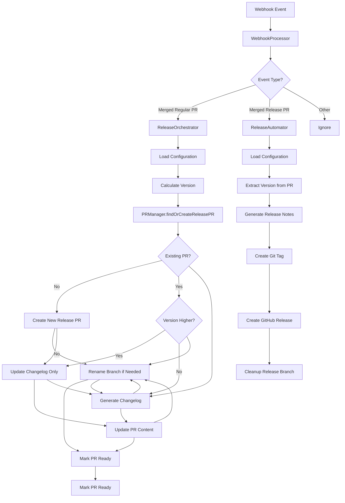

# Complete Release Automation Specification

**Milestones**: 0.3 & 0.4 - Complete Release Automation
**Goal**: End-to-end automated release workflow - from merged PRs to published releases
**Date**: July 17, 2025
**Status**: Ready for Implementation

## Goal

Implement the complete automated release workflow that handles both release PR management (when regular PRs are merged) and GitHub release creation (when release PRs are merged), providing a full end-to-end solution.

## Scope

### What's Included

**Release PR Management (Issue #11)**:

- **Release orchestration layer** connecting webhook processing to PR management
- **Complete GitHub API implementation** for PR creation, updating, and searching
- **Branch management** for release branches with intelligent naming
- **Release PR workflow** with version-aware update logic

**Release Automation (Issue #15)**:

- **Release creation workflow** when release PRs are merged
- **GitHub release and tag creation** with complete metadata
- **Release notes generation** from accumulated changelogs
- **Release validation and publishing** with proper error handling

**Shared Infrastructure**:

- **Configuration integration** with templated PR titles and bodies
- **Comprehensive testing** including integration scenarios
- **CLI enhancement** for testing complete release workflows locally

### What's Excluded

- Detailed user facing logs showing how the version was calculated
- Advanced versioning overrides via PR comments (Future enhancement)
- Notification systems integration (Future)
- Web UI or monitoring interfaces (Future)
- Multi-repository support (Future)
- Plugin system for custom integrations (Future)

## Architecture

### Component Overview



### Core Components

#### 1. Release Orchestrator (New)

**Location**: `crates/core/src/release_orchestrator.rs`

Central coordinator that processes merged PRs and manages the release workflow.

**Responsibilities**:

- Receives `ProcessingResult::MergedPullRequest` from webhook processor
- Loads repository configuration
- Calculates semantic version from commits
- Orchestrates PR creation/update through PRManager
- Handles error recovery and logging

**Key Methods**:

```rust
pub async fn process_merged_pr(
    &self,
    repository: RepositoryInfo,
    pull_request: PullRequestInfo,
) -> CoreResult<ReleaseProcessingResult>

pub async fn calculate_next_version(
    &self,
    repo_info: &RepositoryInfo,
    base_ref: &str,
) -> CoreResult<SemanticVersion>
```

#### 2. PR Manager (Enhanced)

**Location**: `crates/github_client/src/pr_management.rs`

Handles all GitHub PR operations with intelligent release PR logic.

**Enhanced Responsibilities**:

- Find existing release PRs by branch pattern
- Create new release PRs with proper branch naming
- Update existing PRs with version-aware logic
- Rename branches when versions change
- Handle branch conflicts gracefully

**New Methods**:

```rust
pub async fn find_or_create_release_pr(
    &self,
    owner: &str,
    repo: &str,
    version: &SemanticVersion,
    changelog: &str,
    config: &ReleasePrConfig,
) -> GitHubResult<ReleasePROperation>

pub async fn rename_pr_branch(
    &self,
    owner: &str,
    repo: &str,
    pr_number: u64,
    new_branch_name: &str,
) -> GitHubResult<()>
```

#### 3. Branch Manager (New)

**Location**: `crates/core/src/branch_manager.rs`

Manages release branch lifecycle and naming.

**Responsibilities**:

- Generate consistent branch names (`release/v{version}`)
- Handle branch creation and updates
- Manage branch conflicts and fallback naming
- Coordinate with Git operations

#### 4. Release Automator (New)

**Location**: `crates/core/src/release_automator.rs`

Handles the complete release creation workflow when release PRs are merged.

**Responsibilities**:

- Detects merged release PRs from webhook events
- Extracts version information from PR branch/title
- Generates comprehensive release notes from PR content
- Creates Git tags with proper metadata
- Creates GitHub releases with changelogs
- Manages release branch cleanup

**Key Methods**:

```rust
pub async fn process_merged_release_pr(
    &self,
    repository: RepositoryInfo,
    pull_request: PullRequestInfo,
) -> CoreResult<ReleaseCreationResult>

pub async fn create_release(
    &self,
    repo_info: &RepositoryInfo,
    version: &SemanticVersion,
    changelog: &str,
) -> CoreResult<Release>
```

#### 5. Release Manager (Enhanced)

**Location**: `crates/github_client/src/release.rs`

Enhanced GitHub release operations with complete tag and release lifecycle.

**Enhanced Responsibilities**:

- Create Git tags with proper commit targeting
- Generate release notes from accumulated changelogs
- Create GitHub releases with all metadata
- Handle draft/prerelease flags appropriately
- Manage release asset uploads (future)

**Enhanced Methods**:

```rust
pub async fn create_git_tag_and_release(
    &self,
    owner: &str,
    repo: &str,
    version: &SemanticVersion,
    changelog: &str,
    target_sha: &str,
) -> GitHubResult<Release>

pub async fn cleanup_release_branch(
    &self,
    owner: &str,
    repo: &str,
    branch_name: &str,
) -> GitHubResult<()>
```

#### 6. Configuration Integration (Enhanced)

Template-based PR creation with configurable titles and bodies.

**Template Variables**:

- `{version}` - Semantic version (e.g., "1.2.3")
- `{version_tag}` - Version with prefix (e.g., "v1.2.3")
- `{changelog}` - Generated changelog content
- `{commit_count}` - Number of commits since last release
- `{date}` - Current date in ISO format

## Technical Considerations

### Version Calculation Strategy

**Current Implementation**: Uses conventional commits via existing `VersionCalculator`

**Integration Points**:

1. Fetch commits since last release using GitHub API
2. Parse commits using existing `git-conventional` integration
3. Calculate semantic version bump using existing logic
4. Handle edge cases (no conventional commits, parsing failures)

### PR Management Logic

**Smart Update Strategy for Regular PRs**:

```rust
match (existing_pr, calculated_version) {
    (None, version) => create_new_pr(version),
    (Some(pr), version) if version > pr.version => update_with_higher_version(pr, version),
    (Some(pr), version) if version == pr.version => update_changelog_only(pr),
    (Some(pr), version) if version < pr.version => {
        // Never downgrade - log warning and update changelog only
        warn!("Calculated version {} lower than existing PR version {}", version, pr.version);
        update_changelog_only(pr)
    }
}
```

### Release Creation Logic

**Merged Release PR Detection**:

```rust
fn is_release_pr(pr: &PullRequestInfo) -> bool {
    pr.head.starts_with("release/") && pr.merged && pr.base == "main"
}

fn extract_version_from_release_pr(pr: &PullRequestInfo) -> CoreResult<SemanticVersion> {
    // Extract from branch name: release/v1.2.3 -> 1.2.3
    // Fallback to PR title parsing if branch name parsing fails
}
```

**Release Creation Workflow**:

```rust
async fn create_complete_release(
    &self,
    repo: &RepositoryInfo,
    version: &SemanticVersion,
    pr_info: &PullRequestInfo,
) -> CoreResult<Release> {
    // 1. Extract changelog from PR body
    let changelog = extract_changelog_from_pr_body(&pr_info.body)?;

    // 2. Create Git tag pointing to merge commit
    let tag_sha = pr_info.merge_commit_sha.as_ref()
        .ok_or_else(|| CoreError::InvalidData("Missing merge commit SHA".into()))?;

    // 3. Create GitHub release with tag
    let release = self.github_client.create_git_tag_and_release(
        &repo.owner, &repo.name, version, &changelog, tag_sha
    ).await?;

    // 4. Cleanup release branch
    self.github_client.cleanup_release_branch(
        &repo.owner, &repo.name, &pr_info.head
    ).await?;

    Ok(release)
}
```

**Branch Naming Strategy**:

- Primary: `release/v{major}.{minor}.{patch}`
- Conflict fallback: `release/v{major}.{minor}.{patch}-{timestamp}`
- Pre-release: `release/v{major}.{minor}.{patch}-{prerelease}`

### GitHub API Integration

**Octocrab Operations**:

```rust
// Create PR
let pr = octocrab.pulls(owner, repo)
    .create(title, head_branch, base_branch)
    .body(body)
    .draft(config.draft)
    .send()
    .await?;

// Update PR
octocrab.pulls(owner, repo)
    .update(pr_number)
    .title(new_title)
    .body(new_body)
    .send()
    .await?;

// Search PRs
let prs = octocrab.pulls(owner, repo)
    .list()
    .state(State::Open)
    .head(&format!("{}:release/", owner))
    .send()
    .await?;
```

### Error Handling

**Retry Strategy**:

- GitHub API failures: Exponential backoff, max 5 retries
- Branch conflicts: Automatic fallback naming
- Version calculation failures: Log and skip (no release needed)
- Network errors: Retry with circuit breaker pattern

**Error Recovery**:

- Partial PR creation: Cleanup and retry
- Branch naming conflicts: Increment suffix and retry
- Malformed commits: Skip and log, continue with valid commits

## Edge Cases

### Version Conflicts

1. **Same Version, Different Changelog**: Update PR body with merged changelog
2. **Higher Version Required**: Rename branch and PR, update all content
3. **Lower Version Calculated**: Log warning, update changelog only (never downgrade)
4. **Invalid Version Format**: Validate and reject, log detailed error

### Branch Management

1. **Branch Already Exists**: Check if it's ours, rename if conflict
2. **Base Branch Changed**: Handle main -> master transitions gracefully
3. **Concurrent Updates**: Use GitHub's optimistic locking and retry
4. **Orphaned Branches**: Cleanup strategy for abandoned release branches

### Processing Failures

1. **No Conventional Commits**: Log and skip (no version bump needed)
2. **Malformed Commit Messages**: Use fallback parsing, warn about format
3. **GitHub API Rate Limits**: Respect limits with exponential backoff
4. **Network Failures**: Queue for retry with dead letter handling

### Release Creation Failures

1. **Missing Merge Commit SHA**: Handle PRs without proper merge commit information
2. **Tag Creation Conflicts**: Handle cases where tag already exists
3. **Release Notes Extraction**: Fallback strategies for malformed PR bodies
4. **Branch Cleanup Failures**: Continue with release creation even if cleanup fails

### Concurrent Processing

1. **Multiple Webhooks**: Process sequentially through queue
2. **Version Race Conditions**: Use latest calculated version always
3. **PR Update Conflicts**: Retry with fresh data on conflict
4. **Branch Race Conditions**: Handle with unique timestamp suffixes
5. **Concurrent Release Creation**: Prevent duplicate releases for same version

## Migration / Refactor Strategy

### Phase 1: Release PR Management

1. Implement `ReleaseOrchestrator` with basic workflow
2. Complete `PRManager` GitHub API integration
3. Add `BranchManager` for consistent naming
4. Integrate with existing configuration system

### Phase 2: Release Automation

1. Implement `ReleaseAutomator` for merged release PRs
2. Complete `ReleaseManager` GitHub API integration
3. Add comprehensive error handling and retry logic
4. Implement branch cleanup logic

### Phase 3: Integration & Testing

1. Connect webhook processor to release orchestrator
2. Add integration tests with real GitHub API
3. Test edge cases and error scenarios
4. Performance testing and optimization

## Acceptance Criteria

### Functional Requirements

1. **✅ Release PR Creation**:
   - Processes merged PR webhooks within 30 seconds
   - Creates release PRs with correct semantic versions
   - Uses configurable templates for titles and bodies
   - Targets correct base branch (main/master)

2. **✅ Release PR Updates**:
   - Updates existing PRs with higher versions
   - Updates changelogs for same versions
   - Never downgrades existing PR versions
   - Renames branches when versions change

3. **✅ GitHub Release Creation**:
   - Creates releases when release PRs are merged
   - Creates proper Git tags pointing to merge commits
   - Uses accumulated changelog from PR body as release notes
   - Handles both regular and pre-release versions

4. **✅ Branch Management**:
   - Creates consistent branch names (`release/v{version}`)
   - Handles naming conflicts gracefully
   - Manages branch lifecycle properly
   - Cleans up release branches after GitHub release creation

5. **✅ Error Handling**:
   - Retries failed operations appropriately
   - Logs errors with correlation IDs
   - Handles rate limits and network failures
   - Provides clear error messages

### Technical Requirements

1. **✅ Performance**:
   - Processes webhooks within 30 seconds
   - Handles concurrent operations safely
   - Respects GitHub API rate limits
   - Minimizes unnecessary API calls

2. **✅ Reliability**:
   - Idempotent operations (safe to retry)
   - Graceful degradation on failures
   - Comprehensive error logging
   - Proper secret management

3. **✅ Testing**:
   - Unit tests for all core logic
   - Integration tests with GitHub API
   - End-to-end webhook processing tests
   - Error scenario testing
   - Complete release workflow testing

## Behavioral Assertions

### Release PR Management (Issue #11)

1. **Release PR creation must complete within 30 seconds of receiving a merged PR webhook**
2. **Version calculations must never downgrade an existing release PR's version**
3. **Branch naming must be consistent across all operations: `release/v{major}.{minor}.{patch}`**
4. **PR updates must preserve existing version if calculated version is lower**
5. **Changelog updates must merge new content with existing content for same versions**
6. **Configuration templates must support all documented template variables**
7. **Release branches must be created from the correct base branch (main/master)**
8. **PR searches must only match release branches owned by the application**
9. **Branch conflicts must be resolved with timestamped fallback naming**

### Release Automation (Issue #15)

10. **GitHub releases must be created within 30 seconds of merging a release PR**
11. **Git tags must point to the exact merge commit SHA from the release PR**
12. **Release notes must be extracted from the release PR body content**
13. **Release branch cleanup must occur after successful release creation**
14. **Version extraction from release PR must handle both branch names and PR titles**
15. **Pre-release versions must be marked appropriately in GitHub releases**
16. **Release creation must not proceed if version extraction fails**
17. **Tag creation conflicts must be handled gracefully with clear error messages**

### General System Requirements

18. **Failed GitHub API calls must retry with exponential backoff up to 5 times**
19. **Malformed commit messages must not block release PR creation for valid commits**
20. **Concurrent webhook processing must not create duplicate release PRs for the same version**
21. **All operations must be idempotent and safe to retry on failure**
22. **Error messages must include correlation IDs for troubleshooting**
23. **Version parsing must strictly follow semantic versioning specification**
24. **Webhook signature validation must be enforced for all incoming requests**
25. **Repository configuration must be validated before processing begins**

## Notes

### Dependencies

- **Existing**: `octocrab` for GitHub API, `git-conventional` for commit parsing
- **Configuration**: Leverage existing config system with new `ReleasePrConfig`
- **Logging**: Use existing `tracing` infrastructure with correlation IDs
- **Testing**: Build on existing test patterns and utilities

### Implementation Order

1. **Start with PRManager**: Complete GitHub API integration
2. **Add ReleaseOrchestrator**: Core workflow coordination
3. **Implement BranchManager**: Consistent branch lifecycle
4. **Connect Components**: Integrate with webhook processing
5. **Add CLI Support**: Local testing and debugging
6. **Comprehensive Testing**: Unit, integration, and end-to-end tests

### Performance Considerations

- **GitHub API Optimization**: Batch operations where possible
- **Caching Strategy**: Cache installation tokens and PR data appropriately
- **Rate Limit Handling**: Proactive rate limit management
- **Async Processing**: Ensure all operations are properly async

### Security Considerations

- **Secret Management**: Secure storage and handling of GitHub tokens
- **API Permissions**: Minimal required permissions for operations
- **Input Validation**: Validate all inputs from webhooks and APIs
- **Audit Logging**: Log all operations for security auditing
