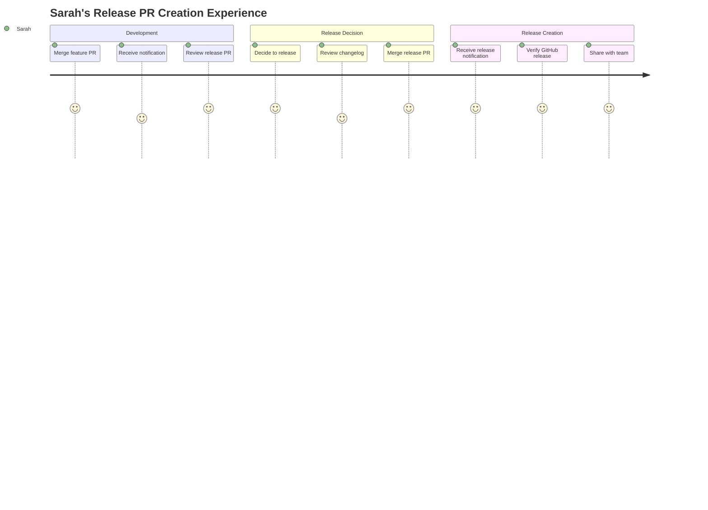
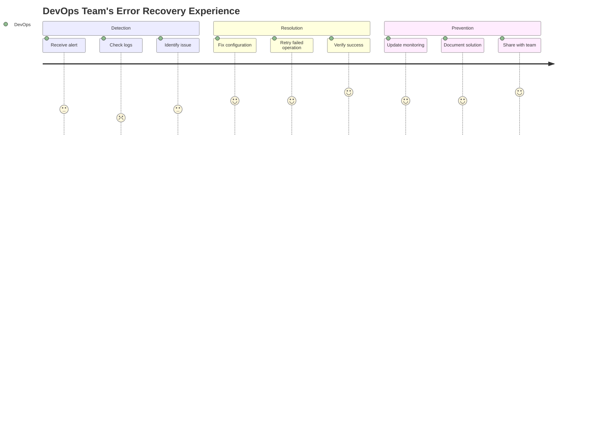

# User Stories & Personas

**Last Updated**: 2025-07-19
**Status**: Complete

## User Personas

### Sarah - Repository Maintainer

**Profile**:

- Maintains 3-5 open source projects
- Values consistency and predictability in release processes
- Wants automation without losing control over release timing
- Needs to provide clear guidance to contributors

**Pain Points**:

- Manual release creation is time-consuming and error-prone
- Different contributors follow different release procedures
- Hard to maintain consistency across multiple repositories
- Release timing often doesn't align with availability

**Goals**:

- Automated release mechanics with human timing control
- Consistent release processes across all repositories
- Clear audit trail for release decisions
- Minimal maintenance overhead

### DevOps Team - Enterprise

**Profile**:

- Manages 200+ internal repositories
- Subject to compliance and audit requirements
- Needs integration with existing CI/CD workflows
- Values reliability and error visibility

**Pain Points**:

- Manual releases don't scale across many repositories
- Inconsistent release processes create compliance risks
- Need detailed audit trails for regulatory requirements
- Difficult to troubleshoot release failures across teams

**Goals**:

- Standardized release automation across all repositories
- Comprehensive logging and audit capabilities
- Integration with existing monitoring and alerting
- Self-service capability for development teams

## User Stories

### US-1: Automated Release PR Creation

**As** Sarah, **I want** Release Regent to automatically create release PRs when changes are merged **so that** I don't have to manually track and create releases.

**Acceptance Criteria**:

- Release PR created within 30 seconds of merge webhook
- PR includes correct semantic version based on conventional commits
- PR contains generated changelog with all changes since last release
- PR targets the correct main branch
- PR uses configurable title and body templates

**Priority**: High
**Status**: In Progress

### US-2: Release PR Management

**As** Sarah, **I want** Release Regent to update existing release PRs with new changes **so that** I have a single PR tracking all unreleased changes.

**Acceptance Criteria**:

- Existing release PR updated with new version if higher
- Changelog updated with new entries
- PR title and branch renamed if version changes
- Never downgrades version in existing PR
- Handles concurrent updates gracefully

**Priority**: High
**Status**: In Progress

### US-3: GitHub Release Creation

**As** Sarah, **I want** GitHub releases to be created automatically when I merge release PRs **so that** the final release publication is seamless.

**Acceptance Criteria**:

- GitHub release created within 30 seconds of release PR merge
- Git tag created pointing to the correct merge commit
- Release notes extracted from release PR body
- Release marked appropriately (draft/prerelease based on config)
- Release branch cleaned up after successful creation

**Priority**: High
**Status**: Planned

### US-4: Version Control

**As** Sarah, **I want** to override the calculated version via PR comments **so that** I can control release timing and version bumps.

**Acceptance Criteria**:

- Comment with version specification updates the PR
- Only valid semantic versions accepted
- Override version must be higher than current version
- Override triggers full PR update with new version

**Priority**: Medium
**Status**: Future Enhancement

### US-5: Error Visibility

**As** the DevOps team, **I want** to be notified when Release Regent encounters persistent failures **so that** I can address issues preventing releases.

**Acceptance Criteria**:

- Transient failures retried up to 5 times
- Persistent failures trigger configurable notifications
- All failures logged with correlation IDs
- Clear error context for troubleshooting
- Integration with existing alerting systems

**Priority**: Medium
**Status**: Future Enhancement

### US-6: Configuration Management

**As** the DevOps team, **I want** to configure Release Regent behavior per repository **so that** different projects can have appropriate release processes.

**Acceptance Criteria**:

- Repository-specific configuration overrides
- Template customization for PR titles and bodies
- Configurable versioning strategies
- Validation of configuration before processing
- Clear error messages for invalid configuration

**Priority**: Medium
**Status**: Complete

### US-7: CLI Testing

**As** Sarah, **I want** to test Release Regent behavior locally **so that** I can validate configuration and debug issues.

**Acceptance Criteria**:

- CLI can simulate webhook processing
- Preview mode shows what would happen without executing
- Local configuration validation
- Test against real repositories safely
- Debug logging for troubleshooting

**Priority**: Medium
**Status**: Complete

### US-8: Audit Trail

**As** the DevOps team, **I want** comprehensive logging of all Release Regent operations **so that** we can meet compliance requirements.

**Acceptance Criteria**:

- All operations logged with correlation IDs
- Structured logging for programmatic analysis
- Audit trail from webhook to release creation
- No sensitive information in logs
- Log retention aligned with compliance requirements

**Priority**: Medium
**Status**: Complete

## User Journey Maps

### Release PR Creation Journey

### Error Recovery Journey

## Success Metrics

### Primary Metrics

- **Release PR Creation Success Rate**: >95% of merged PRs result in successful release PR creation
- **End-to-End Processing Time**: <30 seconds from webhook to PR creation/update
- **Version Calculation Accuracy**: >99% of version calculations are semantically correct
- **Error Recovery Rate**: >90% of transient failures resolve within 5 retries

### Secondary Metrics

- **User Satisfaction**: Repository maintainers report improved release workflow efficiency
- **Configuration Adoption**: >80% of repositories use custom configuration templates
- **Support Request Volume**: <5 support requests per month per 100 repositories
- **Audit Compliance**: 100% of operations have complete audit trails

## Constraints & Assumptions

### Technical Constraints

- GitHub API rate limits may affect processing speed during high-traffic periods
- Webhook delivery reliability depends on GitHub's infrastructure
- Serverless cold starts may impact initial response times
- Repository size affects commit fetching performance

### Business Constraints

- Must integrate with existing GitHub workflow without disruption
- Configuration complexity should not exceed current CI/CD setup complexity
- Error messages must be actionable by repository maintainers
- Audit trail requirements vary by organization compliance needs

### Assumptions

- Repository maintainers understand conventional commit message format
- Teams are comfortable with semantic versioning principles
- GitHub App permissions model is sufficient for required operations
- Repository configuration can be managed through standard Git workflows
