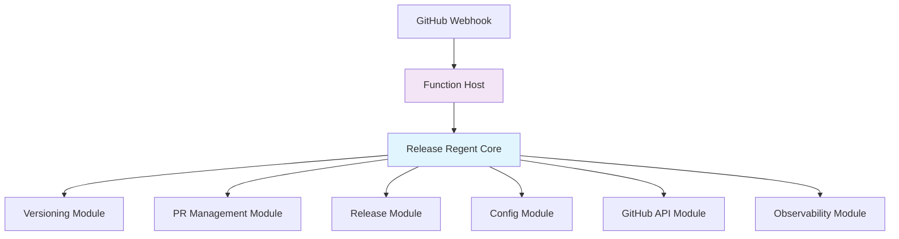
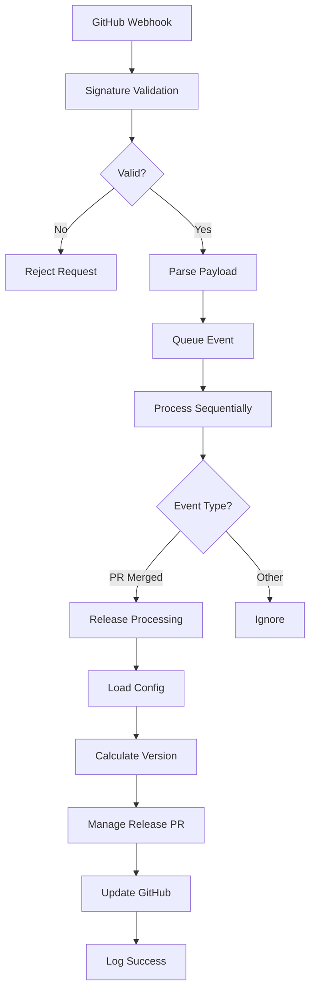
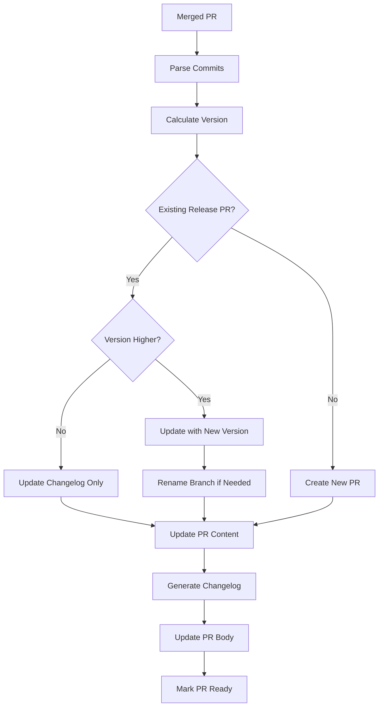

# Release Regent Specification

**Version**: 1.1
**Last Updated**: June 21, 2025
**Status**: Ready for Implementation

## Table of Contents

1. [Overview](#1-overview)
2. [Problem & Solution](#2-problem--solution)
3. [User Requirements](#3-user-requirements)
4. [System Design](#4-system-design)
5. [Implementation Plan](#5-implementation-plan)
6. [Configuration](#6-configuration)
7. [Operations](#7-operations)
8. [Security](#8-security)
9. [Testing](#9-testing)
10. [Deployment](#10-deployment)

---

## 1. Overview

Release Regent is a GitHub App that automates release management by creating and updating release pull requests, determining semantic versions, and publishing GitHub releases. It's designed for teams who want automated releases without the complexity of full continuous deployment.

### What It Does

Release Regent watches for merged pull requests and automatically:

- Creates release PRs with calculated semantic versions
- Updates existing release PRs with new changes and higher versions if needed
- Generates changelogs based on conventional commits
- Creates GitHub releases and tags when release PRs are merged
- Provides a CLI for local testing and configuration

### Who It's For

**Repository Maintainers** who want consistent, automated releases without manual overhead.

**Enterprise Teams** who need controlled, auditable release processes that integrate with existing workflows.

### Key Design Principles

- **Reliability first**: Consistent operation over performance optimization
- **Developer control**: Automate the mechanics while preserving timing control
- **Audit-friendly**: Clear logs and traceability for compliance
- **Simple to start**: Sensible defaults with customization options

---

## 2. Problem & Solution

### The Problem

Most teams fall into one of two camps: either they deploy every merge to main (full CD), or they manage releases manually. There's a gap for teams who want automated release management but need control over timing.

**Current pain points**:

- **Manual overhead**: Creating releases manually is time-consuming and error-prone
- **Inconsistent processes**: Different team members follow different procedures
- **Timing mismatch**: Need to release when ready, not on every merge
- **Tool limitations**:
  - release-please is finicky and unreliable
  - release-plz only works for Rust crates
  - Other tools do extra deployment work that isn't always needed

### Our Solution

Release Regent sits in the sweet spot between manual releases and full continuous deployment. It automates all the mechanical parts (version calculation, PR creation, changelog generation) while letting developers control when releases actually happen.

**How it works**:

1. Developer merges a PR with conventional commit messages
2. Release Regent creates or updates a release PR with the calculated version
3. Developer reviews and merges the release PR when ready
4. Release Regent creates the GitHub release and tag automatically

This gives you automated consistency with human control over timing.

---

## 3. User Requirements

### User Personas

**Sarah - Repository Maintainer**

- Maintains 3-5 open source projects
- Wants predictable release processes for contributors
- Values consistency across repositories
- Needs automation without losing control

**DevOps Team - Enterprise**

- Manages 200+ internal repositories
- Requires audit trails and compliance
- Needs integration with existing workflows
- Values reliability and error visibility

### User Stories

#### US-1: Automated Release PR Creation

**As** Sarah, **I want** Release Regent to automatically create release PRs when changes are merged **so that** I don't have to manually track and create releases.

**Acceptance criteria**:

- Release PR created within 30 seconds of merge webhook
- PR includes correct semantic version based on conventional commits
- PR contains generated changelog with all changes since last release
- PR targets the correct main branch

#### US-2: Release PR Management

**As** Sarah, **I want** Release Regent to update existing release PRs with new changes **so that** I have a single PR tracking all unreleased changes.

**Acceptance criteria**:

- Existing release PR updated with new version if higher
- Changelog updated with new entries
- PR title and branch renamed if version changes
- Never downgrades version in existing PR

#### US-3: Version Control

**As** Sarah, **I want** to override the calculated version via PR comments **so that** I can control release timing and version bumps.

**Acceptance criteria**:

- Comment with version specification updates the PR
- Only valid semantic versions accepted
- Override version must be higher than current version

#### US-4: Error Visibility

**As** the DevOps team, **I want** to be notified when Release Regent encounters persistent failures **so that** I can address issues preventing releases.

**Acceptance criteria**:

- Transient failures retried up to 5 times
- Persistent failures trigger configurable notifications
- All failures logged with correlation IDs
- Clear error context for troubleshooting

### Functional Requirements

The system needs to:

- Handle GitHub webhook events (especially `pull_request.closed` with merged=true)
- Create and update release pull requests on the main branch
- Calculate semantic versions from commit messages or external strategies
- Create Git tags and GitHub releases when release PRs are merged
- Provide CLI tools for local testing and simulation
- Support both app-wide and repository-specific configuration

### Non-Functional Requirements

- **Performance**: Process webhooks within 30 seconds, auto-scale for burst traffic
- **Reliability**: Retry failed operations with exponential backoff, idempotent core operations
- **Security**: Validate webhook signatures, secure secret storage, least privilege access
- **Observability**: Structured logging with correlation IDs, comprehensive metrics and alerts

---

## 4. System Design

### Architecture Overview



### Core Modules

#### Config Module

Loads and validates configuration from multiple sources with hybrid validation approach.

**Key functions**:

- `loadConfig(repoPath)` - Merge app-wide and repo-specific config
- `validateConfig(config)` - Strict validation for critical fields, defaults for optional
- `getDefaults()` - Return baseline configuration

**Validation strategy**:

- **Strict** for critical fields: version_prefix, main branch, notification settings
- **Defaults** for optional fields: templates, retry counts, release settings
- **Clear errors** with field-specific guidance

#### GitHub Module

Handles all GitHub API interactions with built-in authentication and rate limiting.

**Key functions**:

- `authenticateApp()` - Generate installation token from JWT
- `createPR(repo, title, body, branch)` - Create new pull request
- `updatePR(prNumber, updates)` - Update existing pull request
- `findReleasePR(repo)` - Find existing release PR
- `createRelease(repo, tag, notes)` - Create GitHub release
- `getCommitsSince(repo, since)` - Fetch commits for changelog

**Built-in features**: Retry logic, rate limit handling, token refresh

#### Versioning Module

Calculates semantic versions using multiple strategies.

**Key functions**:

- `calculateVersion(commits, currentVersion)` - Main version calculation
- `parseConventionalCommits(commits)` - Parse conventional commit messages
- `getExternalVersion(strategy)` - Plugin interface for custom versioning
- `validateVersion(version)` - Semantic version validation

**Strategies**:

- **Primary**: Conventional commits with SemVer
- **External**: Custom scripts or plugins
- **Override**: PR comment-based specification
- **Fallback**: Log and skip when calculation fails

#### PR Management Module

Creates and updates release PRs with intelligent version handling.

**Key functions**:

- `findOrCreateReleasePR(repo, version)` - Find existing or create new
- `updateReleasePR(pr, version, changelog)` - Update PR content
- `renamePRBranch(pr, newVersion)` - Handle version changes
- `checkVersionCompatibility(existing, new)` - Prevent downgrades

**Smart handling**:

- Updates existing PR with higher versions
- Renames branches and PRs when versions change
- Never downgrades versions
- Updates changelog for same versions

#### Release Module

Creates Git tags and GitHub releases after PR merge.

**Key functions**:

- `createTag(repo, version, sha)` - Create Git tag
- `generateChangelog(commits, version)` - Build changelog from commits
- `publishRelease(repo, version, changelog)` - Create GitHub release

#### CLI Module

Provides local testing and configuration tools.

**Commands**:

- `rr init` - Generate sample configuration
- `rr preview --version X.Y.Z` - Show simulated changes without executing
- `rr run --event-file webhook.json` - Execute core logic locally

### Data Flow

#### Webhook Processing



#### Release PR Workflow



### Edge Cases & Error Handling

#### Version Conflicts

- **Same version**: Update changelog content only
- **Higher version needed**: Rename branch and PR, update with new version
- **Invalid version**: Validate against SemVer rules, reject if invalid
- **Branch conflicts**: Handle rename conflicts gracefully with fallback naming

#### Processing Failures

- **No conventional commits**: Log event and skip (no release needed)
- **Malformed commits**: Use fallback parsing or skip with detailed logging
- **External strategy failure**: Retry with backoff, fall back to conventional if configured
- **GitHub API failures**: Retry with exponential backoff up to 5 times

#### Concurrent Processing

- **Multiple webhooks**: Queue events and process sequentially
- **Version race conditions**: Always use highest calculated version
- **API conflicts**: Use GitHub's optimistic locking where possible

---

## 5. Implementation Plan

### Phase 1: MVP

**Goal**: Basic automated release PR creation and management

**Components**:

- Webhook processing with signature validation
- Basic conventional commit parsing
- Release PR creation and updates
- Core configuration loading
- GitHub API integration with authentication
- CLI for local testing (`rr init`, `rr run`)
- Basic logging and error handling

**Success criteria**:

- Processes `pull_request.closed` webhooks reliably
- Creates release PRs with correct semantic versions
- Updates existing PRs with new changes
- CLI can simulate webhook processing locally

### Phase 2: Enhanced Features

**Goal**: Advanced versioning and robust error handling

**Components**:

- External versioning strategy support
- PR comment-based version overrides
- Enhanced error handling with retry logic
- Improved configuration validation
- Queue-based webhook processing
- CLI preview functionality

**Success criteria**:

- Supports external versioning scripts
- Handles version overrides via comments
- Processes concurrent webhooks without conflicts
- Robust error handling with proper retries

### Phase 3: Notifications & Monitoring

**Goal**: Comprehensive observability and notifications

**Components**:

- Notification system (GitHub issues, webhooks)
- Comprehensive monitoring and metrics
- Enhanced logging with correlation IDs
- Alert configuration and delivery
- Performance optimizations

**Success criteria**:

- Notifies maintainers of persistent failures
- Provides operational visibility through metrics
- Meets 30-second processing target
- Reliable alert delivery

### Phase 4: Production Hardening

**Goal**: Enterprise-ready deployment and security

**Components**:

- Terraform infrastructure automation
- Security hardening and audit compliance
- Performance testing and optimization
- Complete documentation
- Advanced CLI features

**Success criteria**:

- Automated infrastructure deployment
- Passes security and compliance requirements
- Handles expected load with performance targets
- Production-ready documentation

### Dependencies & Risks

**Key dependencies**:

- GitHub API rate limits (may need optimization in Phase 3)
- Serverless cold start performance (address in Phase 3)

**Risk mitigation**:

- Configuration complexity → Good defaults and validation
- External versioning complexity → Simple plugin interface design

---

## 6. Configuration

### Configuration Schema

#### Application-wide Configuration

Stored in a YAML file next to the application binary for the CLI, or stored in a configuration management
system for the serverless function.

```yaml
# Core settings (required)
version_prefix: "v"           # Prefix for version tags
branches:
  main: "main"               # Main branch name (required)

# Release PR settings
release_pr:
  title_template: "chore(release): ${version}"
  body_template: |
    ## Changelog

    ${changelog}
  draft: false

# GitHub release settings
releases:
  draft: false
  prerelease: false
  generate_notes: true

# Error handling
error_handling:
  max_retries: 5
  backoff_multiplier: 2
  initial_delay_ms: 1000

# Notifications
notifications:
  enabled: true
  strategy: "github_issue"    # "github_issue" | "webhook" | "slack" | "none"
  github_issue:
    labels: ["release-regent", "bug"]
    assignees: []
  webhook:
    url: "https://example.com/webhook"  # Required if strategy is "webhook"
    headers: {}                         # Optional custom headers
  slack:
    webhook_url: "https://hooks.slack.com/services/XXX/YYY/ZZZ"  # Required if strategy is "slack"
    channel: "#release-notifications"  # Optional channel override

# Versioning strategy
versioning:
  strategy: "conventional"    # "conventional" | "external"
  external:
    command: "./scripts/calculate-version.sh"  # Required if strategy is "external"
    timeout_ms: 30000
  allow_override: true        # Allow PR comment overrides
```

#### Repository-specific Overrides

Any subset of the application schema can be overridden in individual repositories:

```yaml
# Example: Disable notifications for this repo
notifications:
  strategy: "none"

# Example: Use external versioning
versioning:
  strategy: "external"
  external:
    command: "./scripts/calculate-version.sh"
```

### Configuration Validation

**Strict validation** (must be correct):

- `branches.main`: Valid Git branch name
- `notifications.webhook.url`: Valid URL if webhook strategy selected
- `versioning.external.command`: Executable path if external strategy selected

**Default handling** (optional with sensible defaults):

- All template strings have working defaults
- Retry and timeout values are performance-tested
- Boolean flags default to safe values

**Error handling**:

- Field-specific guidance for validation failures
- Examples of correct configuration for each field
- Clear indication of required vs optional fields

---

## 7. Operations

### Logging Strategy

We use structured JSON logs with correlation IDs for request tracing:

```json
{
  "timestamp": "2025-06-21T10:30:00Z",
  "level": "INFO",
  "correlation_id": "req_abc123",
  "repository": "owner/repo",
  "event": "release_pr_created",
  "version": "1.2.3",
  "pr_number": 42,
  "processing_time_ms": 1250
}
```

**Log levels**:

- **ERROR**: Failed operations that need attention
- **WARN**: Degraded performance or retries
- **INFO**: Normal operations and milestones
- **DEBUG**: Detailed execution flow (disabled in production)

### Metrics & Monitoring

#### Primary Metrics

- **End-to-end success rate**: Percentage of successful webhook-to-PR workflows (target: >95%)
- **Processing time**: Time from webhook to completion (target: <30 seconds)
- **Webhook queue depth**: Number of pending events (alert if >50)
- **Retry counts**: Track operation failures by type
- **Notification delivery success**: Monitor alert delivery

#### Secondary Metrics

- **GitHub API success rates**: Track API reliability and rate limiting
- **Configuration validation failures**: Monitor config issues across repos
- **Version calculation accuracy**: Track successful vs failed determinations
- **Cold start frequency**: Monitor serverless performance

### Alerting

**Critical alerts** (immediate response):

- End-to-end success rate drops below 95%
- Processing time consistently exceeds 60 seconds
- Webhook queue depth exceeds 50 events
- Authentication failures (expired tokens, invalid signatures)

**Warning alerts** (next business day):

- Retry count increases significantly
- Notification delivery failures
- Configuration validation error rate increases
- GitHub API rate limit approaching

### Error Handling

**Retry strategy**:

- Exponential backoff: 1s, 2s, 4s, 8s, 16s
- Maximum 5 retries for transient failures
- Different retry counts for different error types

**Failure handling**:

- Dead-letter queue for unprocessable events
- Circuit breaker for consistent GitHub API failures
- Graceful degradation during partial outages

**Recovery procedures**:

- Manual replay of failed webhook events
- Configuration rollback procedures
- Emergency disable switch for problematic repositories

### Maintenance

**Regular maintenance**:

- Weekly review of error logs and retry patterns
- Monthly GitHub App token rotation
- Quarterly dependency updates and security scanning

**Troubleshooting**:

- Correlation ID tracking across all systems
- Debug mode for detailed logging
- Manual webhook replay for testing fixes

---

## 8. Security

### Authentication & Authorization

**GitHub App Authentication**:

- Use GitHub App JWT to generate short-lived installation tokens
- Minimal scopes: `contents:write`, `pull_requests:write`, `metadata:read`
- Token refresh handled automatically with fallback retry

**Deployment Credentials**:

- Store in Azure Key Vault (Azure) or AWS Secrets Manager (AWS)
- Use managed identities where possible
- Rotate credentials quarterly

### Webhook Security

**Signature Verification**:

- Validate `X-Hub-Signature-256` header against `GITHUB_WEBHOOK_SECRET`
- Use constant-time comparison to prevent timing attacks
- Reject requests with invalid or missing signatures

**Additional Protection**:

- Rate limiting on webhook endpoint
- Payload size limits (reject >1MB payloads)
- User-Agent validation for GitHub webhooks

### Secrets Management

**Storage Strategy**:

- GitHub Environments for CI/CD secrets (`master` and `deploy` environments)
- Cloud secret stores for runtime secrets (Key Vault, Secrets Manager)
- Never store secrets in code or logs

**Access Control**:

- Principle of least privilege for all service accounts
- Regular access reviews and key rotation
- Audit logs for all secret access

### Code Security

**Static Analysis**:

- Cargo Clippy and Rustfmt for Rust code
- GitHub CodeQL for security scanning
- Dependency scanning with Dependabot
- Regular security updates

**Runtime Security**:

- Input validation for all webhook payloads
- Output encoding for all GitHub API calls
- Memory-safe operations (avoid buffer overflows)

### Network Security

**Function Deployment**:

- Deploy with VNet integration (Azure) or VPC (AWS)
- Restrict Key Vault/Secrets Manager access to function subnet
- Use private endpoints where available

**API Security**:

- TLS 1.3 for all external communications
- Certificate pinning for GitHub API calls
- Request signing for webhook validation

### Audit & Compliance

**Logging Requirements**:

- All authentication events logged
- All configuration changes tracked
- All GitHub API calls recorded with correlation IDs

**Data Protection**:

- No PII stored or logged
- Repository data processed in memory only
- Webhook payloads not persisted

---

## 9. Testing

### Testing Strategy

#### Unit Tests

- Each module tested with mocked dependencies
- Focus on edge cases and error conditions
- Target >90% code coverage
- Property-based testing for version calculation logic

#### Integration Tests

- Use GitHub's webhook testing tools
- Test with real GitHub API (against test repositories)
- Validate configuration loading and validation
- Test CLI commands against sample repositories

#### End-to-End Tests

- Full webhook-to-release workflows
- Test against multiple repository configurations
- Validate release PR creation, updates, and merging
- Test concurrent webhook processing

#### Performance Tests

- Simulate burst webhook traffic
- Measure cold start times and optimization
- Test GitHub API rate limit handling
- Validate 30-second processing target

#### Security Tests

- Static analysis with CodeQL
- Dependency vulnerability scanning
- Webhook signature validation testing
- Secret exposure scanning

### Test Data Management

**Test Repositories**:

- Dedicated GitHub organization for testing
- Automated test repo creation and cleanup
- Sample configurations for different scenarios
- Test webhook generation tools

**Test Isolation**:

- Separate test environments for each phase
- Independent GitHub App installations for testing
- Isolated cloud resources for integration tests

### Continuous Testing

**PR Testing**:

- Unit and integration tests on every PR
- Security scanning on dependency changes
- Configuration validation tests

**Release Testing**:

- Full end-to-end tests before deployment
- Performance benchmarking
- Security penetration testing

---

## 10. Deployment

### Infrastructure

#### Azure Resources

```hcl
# Terraform configuration
resource "azurerm_resource_group" "release_regent" {
  name     = "release-regent-${var.environment}"
  location = var.location
}

resource "azurerm_storage_account" "function_storage" {
  name                = "releaseregent${var.environment}"
  resource_group_name = azurerm_resource_group.release_regent.name
  location           = azurerm_resource_group.release_regent.location
  account_tier       = "Standard"
  account_replication_type = "LRS"
}

resource "azurerm_service_plan" "function_plan" {
  name                = "release-regent-plan-${var.environment}"
  resource_group_name = azurerm_resource_group.release_regent.name
  location           = azurerm_resource_group.release_regent.location
  os_type            = "Linux"
  sku_name           = "Y1"  # Consumption plan
}

resource "azurerm_linux_function_app" "release_regent" {
  name                = "release-regent-${var.environment}"
  resource_group_name = azurerm_resource_group.release_regent.name
  location           = azurerm_resource_group.release_regent.location
  service_plan_id    = azurerm_service_plan.function_plan.id
  storage_account_name = azurerm_storage_account.function_storage.name
  storage_account_access_key = azurerm_storage_account.function_storage.primary_access_key

  identity {
    type = "SystemAssigned"
  }
}

resource "azurerm_key_vault" "secrets" {
  name                = "release-regent-kv-${var.environment}"
  resource_group_name = azurerm_resource_group.release_regent.name
  location           = azurerm_resource_group.release_regent.location
  tenant_id          = data.azurerm_client_config.current.tenant_id
  sku_name           = "standard"
}
```

#### AWS Resources

```hcl
# Lambda function
resource "aws_lambda_function" "release_regent" {
  filename         = "release-regent.zip"
  function_name    = "release-regent-${var.environment}"
  role            = aws_iam_role.lambda_role.arn
  handler         = "index.handler"
  runtime         = "nodejs18.x"
  timeout         = 30

  environment {
    variables = {
      ENVIRONMENT = var.environment
    }
  }
}

# IAM role with minimal permissions
resource "aws_iam_role" "lambda_role" {
  name = "release-regent-lambda-${var.environment}"

  assume_role_policy = jsonencode({
    Version = "2012-10-17"
    Statement = [
      {
        Action = "sts:AssumeRole"
        Effect = "Allow"
        Principal = {
          Service = "lambda.amazonaws.com"
        }
      }
    ]
  })
}

# API Gateway for webhook endpoint
resource "aws_api_gateway_rest_api" "webhook" {
  name = "release-regent-webhook-${var.environment}"
}
```

### CI/CD Pipeline

#### GitHub Environments

- **`on-master-push`**: Accessible from `main` branch, contains Terraform plan secrets
- **`on-release-publish`**: Accessible from tags, contains apply and deployment secrets

#### Terraform Workflow

```yaml
# .github/workflows/terraform-plan.yml
name: Terraform Plan
on:
  push:
    branches: [main]
jobs:
  plan:
    environment: on-master-push
    runs-on: ubuntu-latest
    steps:
      - uses: actions/checkout@v4
      - uses: hashicorp/setup-terraform@v3
        with:
          terraform_version: 1.6.0
      - name: Terraform Init
        run: terraform init
      - name: Terraform Plan
        run: terraform plan -out=tfplan
      - name: Upload Plan
        uses: actions/upload-artifact@v4
        with:
          name: terraform-plan
          path: tfplan
```

```yaml
# .github/workflows/deploy.yml
name: Deploy
on:
  push:
    tags: ["v*"]
jobs:
  deploy:
    environment: on-release-publish
    runs-on: ubuntu-latest
    steps:
      - uses: actions/checkout@v4
      - uses: hashicorp/setup-terraform@v3
        with:
          terraform_version: 1.6.0
      - name: Terraform Init
        run: terraform init
      - name: Terraform Apply
        run: terraform apply -auto-approve
      - name: Deploy Function (Azure)
        run: func azure functionapp publish ${{ secrets.FUNCTION_APP_NAME }}
      - name: Deploy Function (AWS)
        run: aws lambda update-function-code --function-name ${{ secrets.LAMBDA_FUNCTION_NAME }} --zip-file fileb://release-regent.zip
```

### Deployment Process

1. **Development**: Code changes pushed to feature branches
2. **Integration**: PRs merged to `main` trigger Terraform plan
3. **Release**: Tags trigger Terraform apply and function deployment
4. **Verification**: Automated tests run against deployed infrastructure
5. **Monitoring**: Alerts configured for deployment success/failure

### Rollback Procedures

**Infrastructure rollback**:

```bash
# Revert to previous Terraform state
terraform apply -auto-approve -target=module.previous_version

# Or use Terraform state manipulation
terraform state mv module.current module.backup
terraform state mv module.previous module.current
```

**Application rollback**:

```bash
# Azure Functions
func azure functionapp publish $FUNCTION_APP_NAME --slot staging
func azure functionapp swap-slot --slot staging

# AWS Lambda
aws lambda update-function-code --function-name $FUNCTION_NAME --zip-file fileb://previous-version.zip
```

### Environment Management

**Staging Environment**:

- Identical infrastructure to production
- Uses test GitHub App installation
- Automated deployment from `main` branch
- Full integration testing before production release

**Production Environment**:

- Deployment only from tagged releases
- Manual approval required for infrastructure changes
- Comprehensive monitoring and alerting
- Automated rollback on deployment failure

---

## Glossary

**Conventional Commits**: A specification for commit message format that enables automated version calculation

**Release PR**: A pull request that contains all changes for an upcoming release, including version bumps and changelog

**Semantic Versioning (SemVer)**: A versioning scheme using MAJOR.MINOR.PATCH format

**Webhook**: HTTP callbacks sent by GitHub when events occur in repositories

**Installation Token**: Short-lived access token generated from GitHub App JWT for API access

**Correlation ID**: Unique identifier used to track requests across system boundaries

**Dead Letter Queue**: Storage for webhook events that cannot be processed after maximum retries

**Circuit Breaker**: Pattern that prevents cascade failures by temporarily disabling failing operations

---

*This specification provides a complete blueprint for implementing Release Regent with consistent voice, comprehensive coverage, and practical implementation guidance.*
